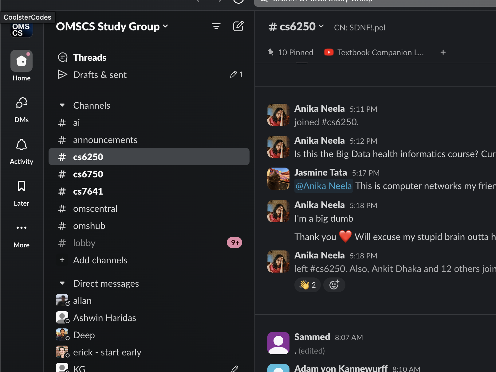
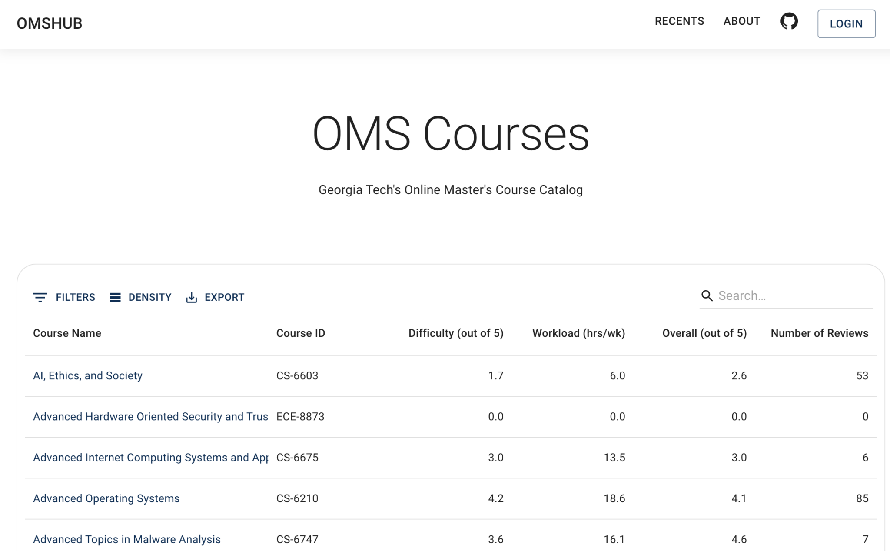
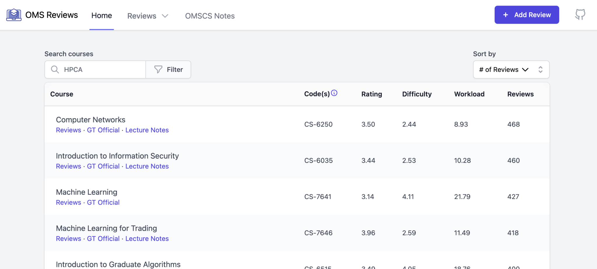
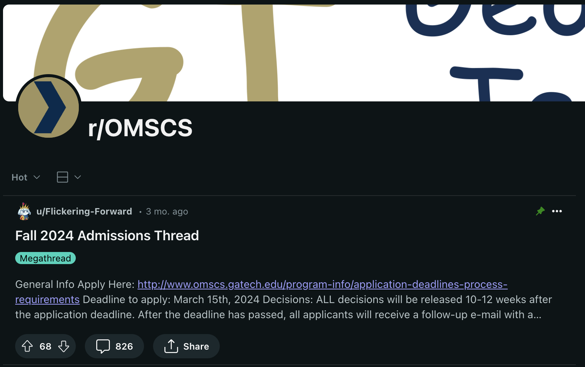
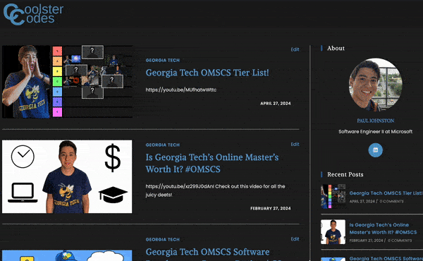
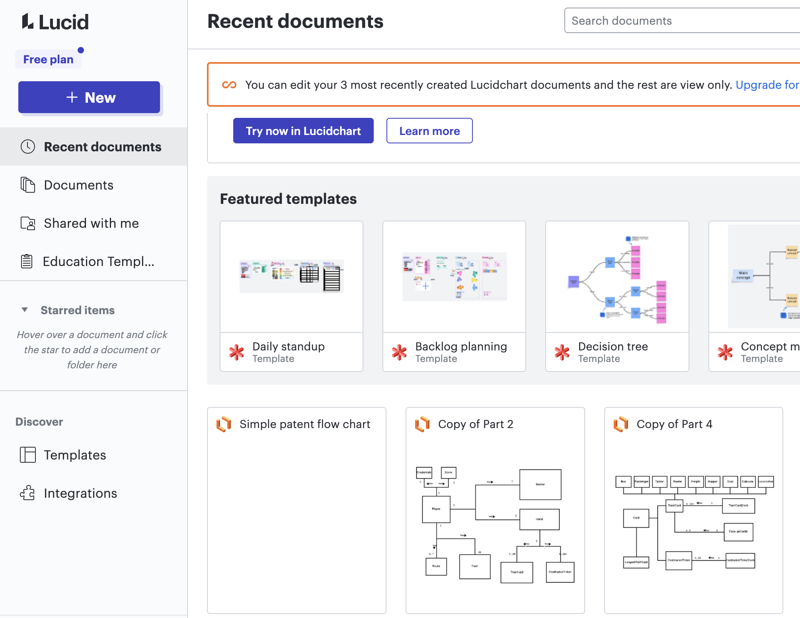
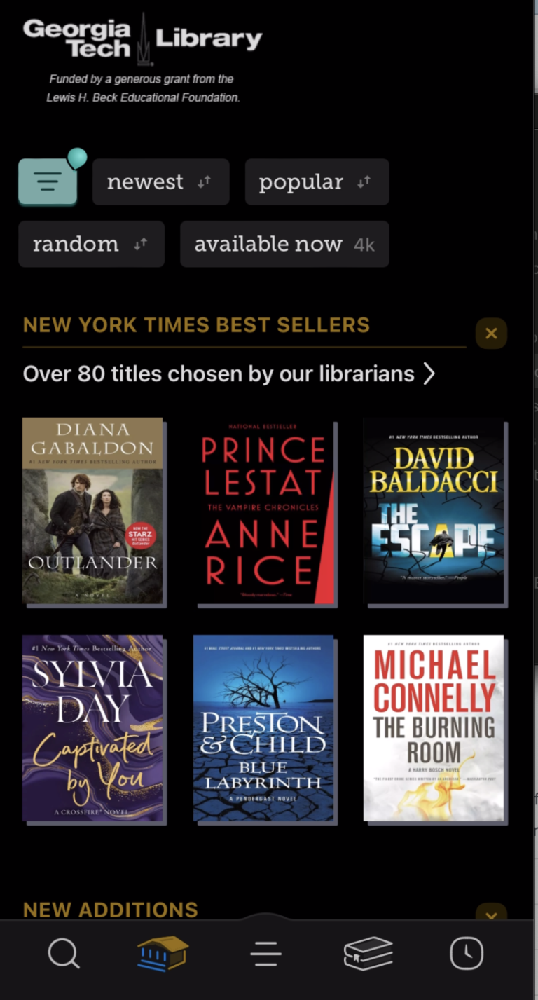
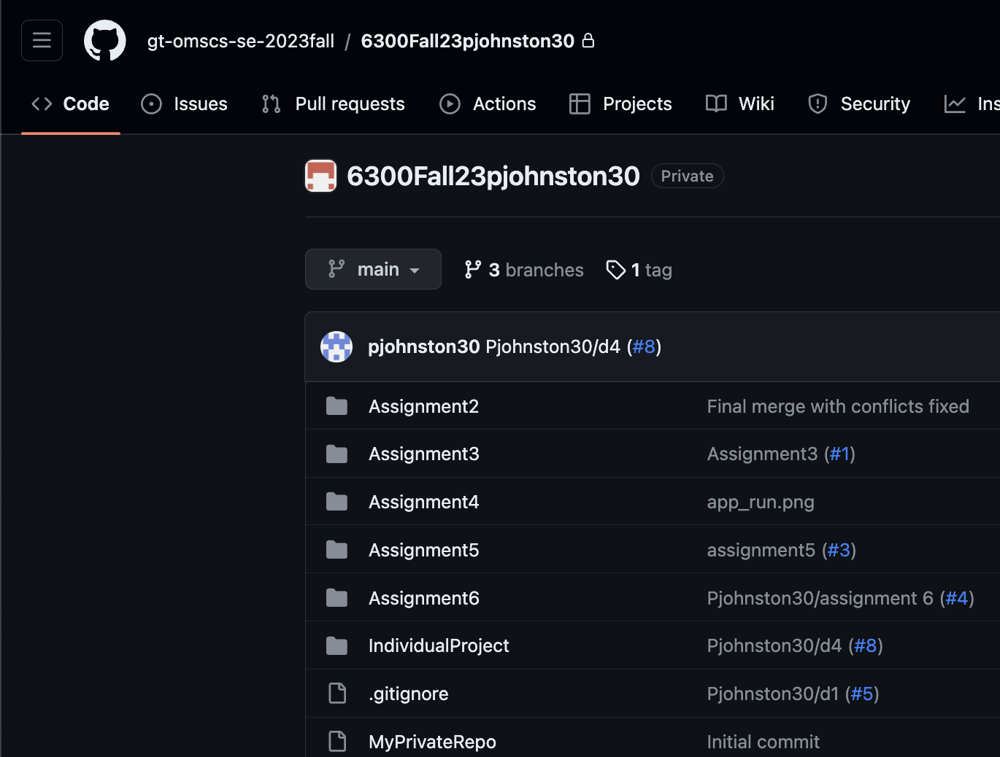
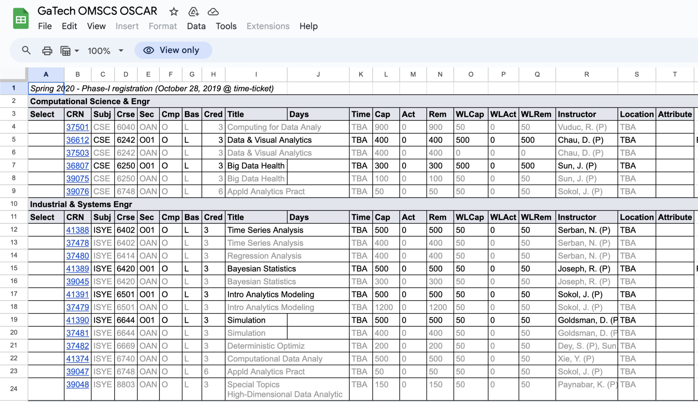

+++
title = "10 Tips and Tricks OMSCS to Survive the OMSCS"
hook = "10 tricks and tips to help you surive the OMSCS"
image = "./tips.jpg"
published_at = 2024-04-27T20:43:02-06:00
tags = ["OMSCS"]
youtube = "https://youtu.be/YbLZn_J7x-E"
+++

## Tip # 1 – Slack!

Sign up here: https://omscs-study.github.io/

- A place for somewhat friendly student interaction 😅
- Can be a bit noisy/weird sometimes

*The unofficial, student-run, OMSCS slack channel*

## Tip #2 – OMS Hub

Access here https://www.omshub.org

- Student-run class reviews for the OMSCS
- Great source to gauge how hard/easy certain classes are

*OMSHub is a great class rating website*

## Tip #3 – OMS Central

Link: https://www.omscentral.com

- Another student-run site to rate classes
- Not sure why there are two haha check both (they honestly align pretty well in terms of score/ratings)

*OMSCentral is another class review site, not sure why there are two haha*

## Tip #4 – Reddit Reviews ?

Link: https://www.reddit.com/r/OMSCS/

- I have never used these personally but I bet you could find some good info there

*Reddit reviews of classes and such*

## Tip #5 – CoolsterCodes!

Shamless plug 😏

- Just a guy trying to help you succeed in the OMSCS
- Really liked the journey

*My Awesome blog 😏*

## Tip #6 – LucidChart

Example : https://lucid.app/documents

- Super useful for diagraming
- Easy to create project reports with it
- Also nice to explain concepts to classmates or ask questions with your design in mind

*Lucidchart free for GT students!*

## Tip #7 – Georgia Tech Library on Libby!

Link: https://libbyapp.com/

- Whole library available to you!
- Tons of books academic or otherwise
- Free / comes with student status

*Libby! Georgia Tech's library has a lot of great reads*

## Tip #8 – Private Github!

FAQ – https://support.cc.gatech.edu/support-tools/faq/what-gt-github-enterprise

- Unlimited private repositories!!
- Super useful to store assignments
- Free

## Tip #9 – Waitlist history!

Link: https://docs.google.com/spreadsheets/d/1rqv6_N1l_xC9xR9RGPXhEoqnZIdaHMdixrqu5g7qSL4/edit#gid=1237086826

Not sure you’re going to get in a class? See the historical data!

- This is super helpful, especially when trying to plan classes!

*You can see historical data on waitlists for classes in the OMSCS!*

## Tip #10 – Family

Tell your friends, help you succeed

- Get support! Don’t feel alone

*Teamwork makes the dream work! Tell you family and friends you are in the program to get support*
