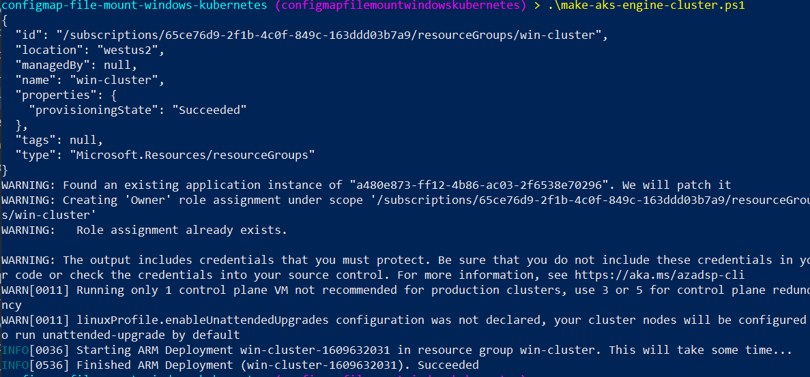
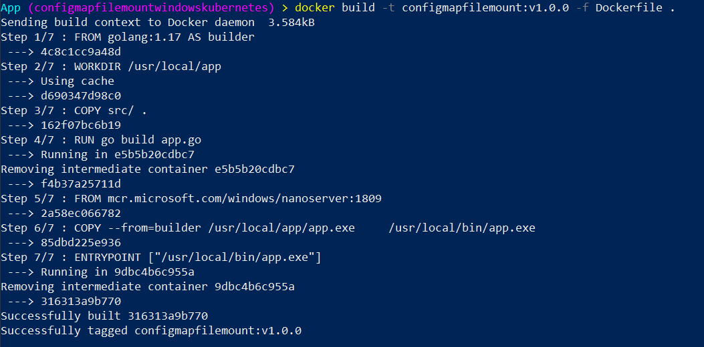
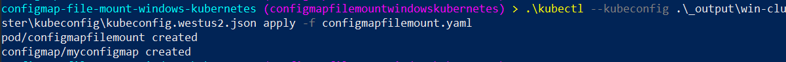
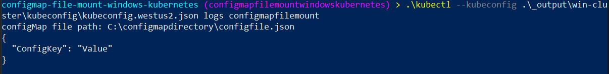

+++
title = "ConfigMap File Mount on a Windows Kubernetes Pod"
hook = "Mounting a ConfigMap as a file in Windows Kubernetes"
image = "./terminal.jpg"
published_at = 2022-01-30T01:01:00-06:00
tags = ["Kubernetes", "Windows"]
youtube = "https://youtu.be/8Sab4zv0GXg"
+++

In this article we will mount a [configMap](https://kubernetes.io/docs/concepts/configuration/configmap/) as a file into a Windows Kubernetes pod.

ConfigMaps let you specify configuration values of an application as part of the deployment yaml. This decouples your application deployment from the config values, which is best practice.

> [Source code](https://github.com/coolstercodes/Tutorials/tree/main/tutorials/configmap-file-mount-windows-kubernetes)

## Create a Windows Kubernetes cluster

We will use [AKS Engine](https://github.com/Azure/aks-engine#readme) to create a Windows Kubernetes cluster.

`make-aks-engine-cluster.ps1` along with win-cluster.json will create a Windows Kubernetes cluster for you in Azure. All you need to provide is a `$SUBSCRIPTION_ID`.

```ps1
$SUBSCRIPTION_ID=''
$CLUSTER_NAME='win-cluster'
$LOCATION='westus2'
$API_MODEL='win-cluster.json'

# Creates the resource group which will house your cluster
az group create --subscription $SUBSCRIPTION_ID --location $LOCATION --name $CLUSTER_NAME

# Creates an Azure Service Principal to let AKS-Engine deploy resources (your cluster) to your resource group
$AZSP=az ad sp create-for-rbac --name win-cluster-service-principal --role="Owner" --scopes="/subscriptions/$SUBSCRIPTION_ID/resourceGroups/$CLUSTER_NAME" -o json | ConvertFrom-Json
$CLIENT_ID=$AZSP.appId
$CLIENT_SECRET=$AZSP.password

# Let azure permissions propogate before creating cluster
Start-Sleep -Seconds 180

# Create a hostprocess capable kubernetes cluster using AKS-Engine
.\aks-engine deploy `
    --subscription-id $SUBSCRIPTION_ID  `
    --client-id $CLIENT_ID `
    --client-secret $CLIENT_SECRET `
    --resource-group $CLUSTER_NAME `
    --dns-prefix $CLUSTER_NAME `
    --location $LOCATION `
    --api-model $API_MODEL `
    --force-overwrite

```

```json
{
   "apiVersion": "vlabs",
   "properties": {
      "orchestratorProfile": {
         "orchestratorType": "Kubernetes",
         "orchestratorRelease": "1.23",
         "kubernetesConfig": {
            "networkPlugin": "azure",
            "containerRuntime": "containerd",
            "windowsContainerdURL": "https://github.com/kubernetes-sigs/sig-windows-tools/releases/download/windows-containerd-nightly/windows-containerd.tar.gz",
            "loadBalancerSku": "basic"
         }
      },
      "masterProfile": {
         "count": 1,
         "vmSize": "Standard_D2_v2",
         "availabilityProfile": "AvailabilitySet",
         "platformUpdateDomainCount": 1
      },
      "agentPoolProfiles": [
         {
            "name": "windowspool",
            "count": 1,
            "vmSize": "Standard_D8s_v3",
            "availabilityProfile": "VirtualMachineScaleSets",
            "osType": "Windows",
            "enableVMSSNodePublicIP": true
         }
      ],
      "windowsProfile": {
         "adminUsername": "azureuser",
         "adminPassword": "password1234$",
         "sshEnabled": true,
         "enableAutomaticUpdates": true,
         "WindowsPublisher": "microsoft-aks",
         "WindowsOffer": "aks-windows",
         "WindowsSku": "2019-datacenter-core-ctrd-2108",
         "imageVersion": "17763.2061.210830"
      },
      "linuxProfile": {
         "adminUsername": "azureuser",
         "ssh": {
            "publicKeys": [
               {
                  "keyData": ""
               }
            ]
         }
      }
   }
}
```

Upon execution of the script, you should hopefully see:


*Deploying a Windows Kubernetes using AKS Engine*

## Build a containerized app

The app we create will simply print the contents of a given file.

```go
package main

import (
	"fmt"
	"io/ioutil"
	"os"
	"time"
)

func main() {
	configMapFilePath := os.Args[1]

	fmt.Printf("configMap file path: %s\n", configMapFilePath)

	// Read the configMap as a file from inside the container!
	content, err := ioutil.ReadFile(configMapFilePath)
	if err != nil {
		fmt.Printf("Error from reading: %v\n", err)
	}
	text := string(content)
	fmt.Println(text)

	// Sleep
	time.Sleep(1 * time.Hour)
}
```

We containerize it with a `Dockerfile`, which packages the executable into container format:

```docker
# Use golang image to build binary
FROM golang:1.17 AS builder

# Make a working directory
WORKDIR /usr/local/app

# Copy the source code into the container
COPY src/ .

# Build the app
RUN go build app.go

# Copy the app binary into the final container image
FROM mcr.microsoft.com/windows/nanoserver:1809
COPY --from=builder /usr/local/app/app.exe \
    /usr/local/bin/app.exe

ENTRYPOINT ["/usr/local/bin/app.exe"]
```

And bulid it using the `docker` command like program like so:


```shell
docker build -t configmapfilemount:v1.0.0 -f Dockerfile .
```


*Building the containerized app*

## Launching a Pod which reads the configMap as a file

Next we define a pod and configMap in `yaml` format,

```yaml
apiVersion: v1
kind: Pod
metadata:
  name: configmapfilemount
spec:
  nodeSelector:
    kubernetes.io/os: windows
  containers:
  - name: configmapfilemount
    image: coolstercodes.azurecr.io/configmapfilemount:v1.0.0
    imagePullPolicy: Always
    args: ["C:\\configmapdirectory\\configfile.json"]
    volumeMounts:
      - name: configmapmount
        mountPath: /configmapdirectory
  volumes:
    - name: configmapmount
      configMap:
        name: myconfigmap
---
apiVersion: v1
kind: ConfigMap
metadata:
  name: myconfigmap
data:
  configfile.json: |
    {
      "ConfigKey": "Value"
    }
```

You’ll see above that we specify a `volume` at the pod layer, and give it the name of our configMap.

Next in the container layer, we specify a `volumeMount`, which mounts the `volume` previously specified.

As part of the `volumeMount` we give a new file path where this configMap will live, according to the container.

And finally, we pass `C:\\configmapdirectory\\configfile.json` to the container as the file we wish to print the contents of.

To deploy this pod, we use `kubectl` like so:

```shell
.\kubectl --kubeconfig .\_output\win-cluster\kubeconfig\kubeconfig.westus2.json apply -f configmapfilemount.yaml
```


*Deploying the pod and configMap*

Then we can check on the container logs with `kubectl` like so:

```shell
.\kubectl --kubeconfig .\_output\win-cluster\kubeconfig\kubeconfig.westus2.json logs configmapfilemount
```


*App logs which print the contents of the “file”, aka the configMap!*

You’re done! Now you’ve deployed a Windows Kubernetes pod which reads a configMap as a file.
