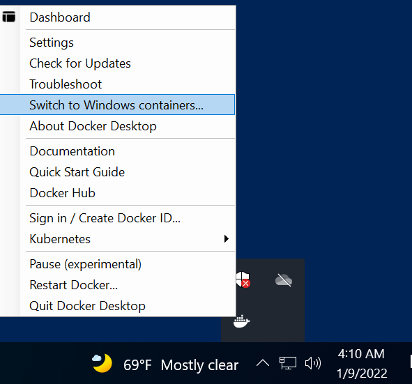
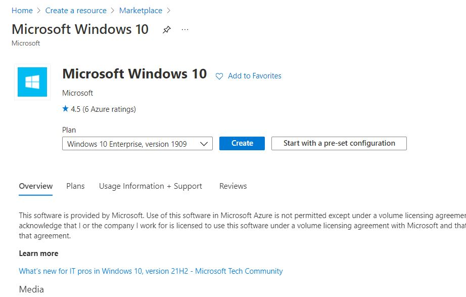
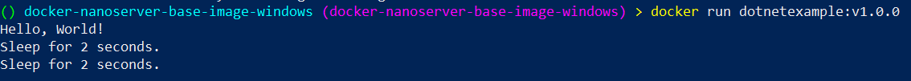
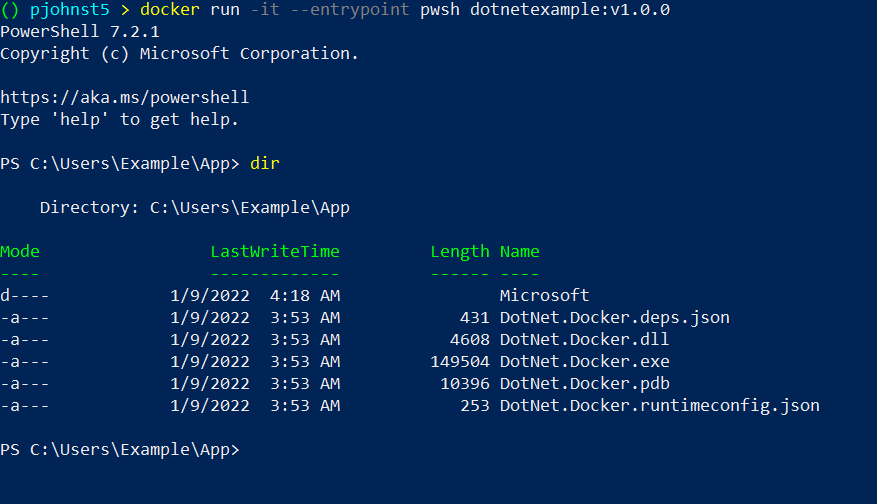

+++
title = "Docker Nanoserver base image Windows"
hook = "Building a docker image using nanoserver base"
image = "./docker.png"
published_at = 2022-01-09T05:30:00-07:00
tags = ["Windows", "Development", "Docker"]
youtube = "https://youtu.be/1ad5dq0Wi-c"
+++

Here we will make a windows Docker image which uses [Windows Nano Server](https://hub.docker.com/_/microsoft-windows-nanoserver) as the base image

This is great for deploying your [.Net](https://dotnet.microsoft.com/en-us/download/dotnet) apps on Docker

> [Source code](https://github.com/coolstercodes/Tutorials/tree/main/tutorials/docker-nanoserver-base-image-windows)


## Prereqs

- [Docker Desktop](https://www.docker.com/products/docker-desktop) installed on Windows Enterprise, Pro or Educational machine
    - Windows Home edition will not work since [Hyper-V](https://docs.microsoft.com/en-us/virtualization/hyper-v-on-windows/quick-start/enable-hyper-v) needs to be enabled and Windows Home just doesn’t offer it
- [Hyper-V](https://docs.microsoft.com/en-us/virtualization/hyper-v-on-windows/quick-start/enable-hyper-v) feature enabled
- [Visual Studio](https://docs.microsoft.com/en-us/visualstudio/install/install-visual-studio?view=vs-2022)
    - Or the .Net 6.0 SDK
- A [.Net](https://dotnet.microsoft.com/en-us/download/dotnet) app (.Net versions 3.1, 5.x and 6.x)
    - [.Net Framework](https://dotnet.microsoft.com/en-us/download/dotnet-framework) apps won’t work on Nano Server (.Net versions 4.x)

## Create the app

First we need to create a sample .Net app

``` shell
dotnet new console -o App -n DotNet.Docker
```

This creates a new folder App with a very simple [console app](https://docs.microsoft.com/en-us/visualstudio/get-started/csharp/tutorial-console?view=vs-2022) in it using .Net version 6.0

## Edit the app

We’re just going to edit it slightly to loop after saying “Hello world!”

``` c#
Console.WriteLine("Hello, World!");

for (int i = 0; i < 500; i++)
{
    Console.WriteLine("Sleep for 2 seconds.");
    Thread.Sleep(2000);
}
```

## Build the app

We’ll build the app and copy the binaries into the container image

Navigate to the App directory and run:

``` shell
dotnet publish -c Release
```

This will create the precious binary files at `App/bin/Release/net6.0/publish`

## Create Dockerfile

Here is the final Dockerfile, though I will explain each part below

``` docker
FROM mcr.microsoft.com/powershell:lts-nanoserver-1909

# Run as admin
USER ContainerAdministrator

# Make default shell powershell
SHELL ["pwsh", "-command"]

# Dotnet 6.0.101 install
WORKDIR Users\\Example\\dotnetinstall\\6.0.101
RUN Invoke-WebRequest -OutFile dotnet-install.ps1 -URI https://dotnet.microsoft.com/download/dotnet/scripts/v1/dotnet-install.ps1
RUN .\dotnet-install.ps1 -Version 6.0.101 -InstallDir """C:\\Users\\Example\\\\dotnetinstall\\6.0.101"""

# Copy the application binaries into the docker image
COPY App/bin/Release/net6.0/publish/ C:\\Users\\Example\\App

# Run the application binaries as the main container program
WORKDIR C:\\Users\\Example\\App
ENTRYPOINT ["C:\\Users\\Example\\dotnetinstall\\6.0.101\\dotnet.exe", "C:\\Users\\Example\\App\\DotNet.Docker.dll"]
```

`FROM mcr.microsoft.com/powershell:lts-nanoserver-1909` is to specify which Docker image we want to use as the base image. This `powershell:lts-nanoserver-1909` image is from [Microsoft’s powershell docker hub](https://hub.docker.com/_/microsoft-powershell). It comes with really lightweight version of the Windows OS called [Nano server](https://hub.docker.com/_/microsoft-windows-nanoserver) which is great for containers, since you generally want to keep container images small.

This `powershell:lts-nanoserver-1909` image also comes with a new version of Powershell 7 called `pwsh` (read more [here](https://docs.microsoft.com/en-us/powershell/scripting/whats-new/what-s-new-in-powershell-70?view=powershell-7.2)).

`pwsh` is an open-source cross-platform version of Powershell. There are a few extra steps to get it to do all of what previous versions of Powershell could do which I will cover in a different article.

`USER ContainerAdministrator` is to make the commands run as admin, since this is not set by default in Windows (Linux it is default). Basically without this command, any subsequent steps can’t access files downloaded/copied from previous steps.

`SHELL ["pwsh", "-command"]` is to make the commands that happen in the RUN sections executed through pwsh instead of the default cmd

`WORKDIR Users\\Example\\dotnetinstall\\6.0.101` is to make a folder in the container image with the given path to use as a workspace. It also navigates to this directory for any subsequent commands.

`RUN Invoke-WebRequest -OutFile dotnet-install.ps1 -URI https://dotnet.microsoft.com/download/dotnet/scripts/v1/dotnet-install.ps1` is to download a [dotnet install script](https://docs.microsoft.com/en-us/dotnet/core/tools/dotnet-install-script) and then the following command is to install the dotnet runtime into the `C:\\Users\\Example\\\\dotnetinstall\\6.0.101` directory. We later use this runtime package to actually run our .Net app.

Instead of manually installing via this `dotnet-install.ps1` script, you could alternatively use `mcr.microsoft.com/dotnet/aspnet:6.0` (read more [here](https://hub.docker.com/_/microsoft-dotnet-aspnet)) as the base image, but I personally find it hard to debug since it doesn’t come with `cmd`, `powershell`, `pwsh`, or any sort of shell.

`COPY App/bin/Release/net6.0/publish/ C:\\Users\\Example\\App` is to copy the folder with the binaries into the container image.

`WORKDIR C:\\Users\\Example\\App` is to create a working directory and finally `ENTRYPOINT ["C:\\Users\\Example\\dotnetinstall\\6.0.101\\dotnet.exe", "C:\\Users\\Example\\App\\DotNet.Docker.dll"]` is to tell Docker to invoke the dotnet runtime which we installed as the main entrypoint of the container, and to pass it the DotNet.Docker.dll file as an argument. This will essentially start our app and print `"Hello world!"` and then loop.

## Build the Docker image

``` shell
docker build -t dotnetexample:v1.0.0 -f .\Dockerfile .
```

Run this command from just outside the App directory. Ensure the Dockerfile is also just outside the App directory.

Remember: you have to enable the Hyper-v feature for Windows 10 Enterprise, Pro or Educational. Windows 10 home will not work.

You must also ensure that Docker Desktop is using Windows Containers:


*Ensure Docker Desktop is using Windows Containers*

If you need quick access to a Windows 10 Enterprise machine, you can create one in [Azure Portal](https://azure.microsoft.com/en-us/features/azure-portal/)


*Creating a Windows Enterprise machine in Azure Portal if need be*

## Run image

``` shell
docker run dotnetexample:v1.0.0
```


*Run the docker image!*

You can also interactively run powershell commands in the container with:

``` shell
docker run -it --entrypoint pwsh dotnetexample:v1.0.0
```


*Interactively run powershell commands in container image*

You've done it!
