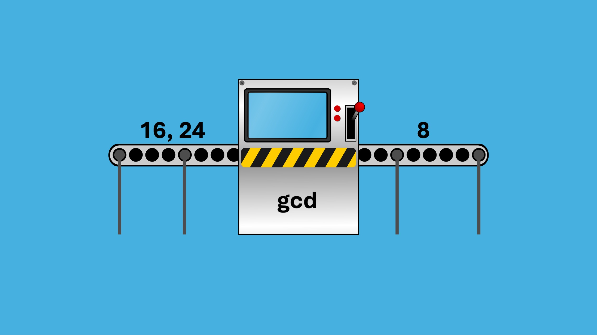
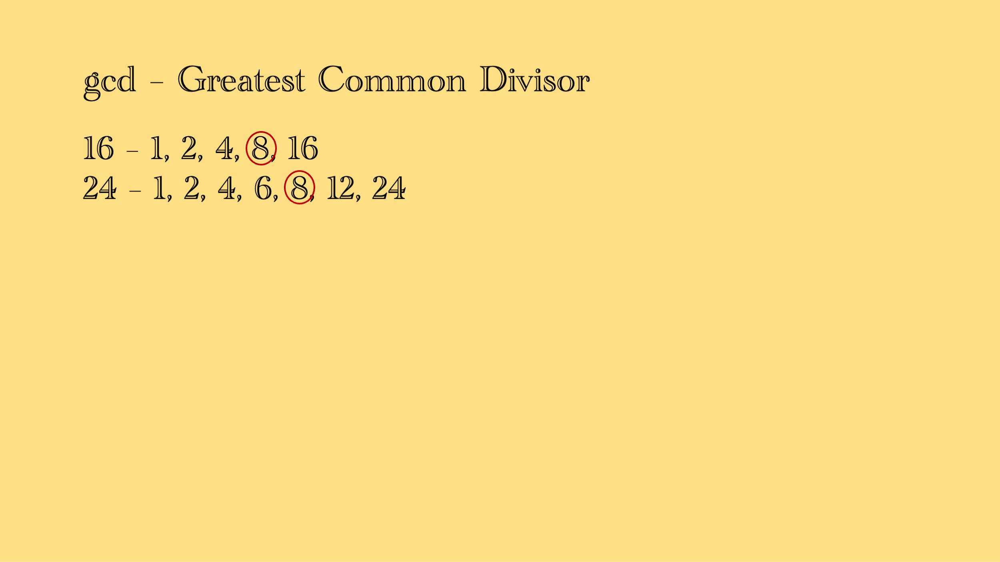
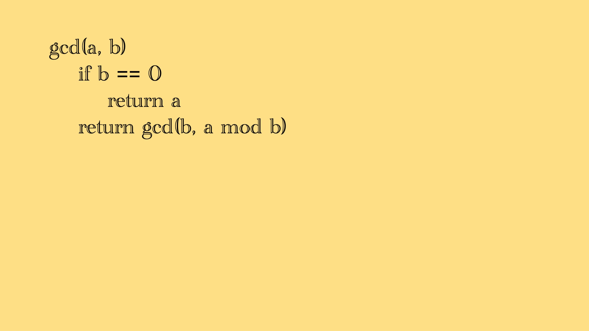
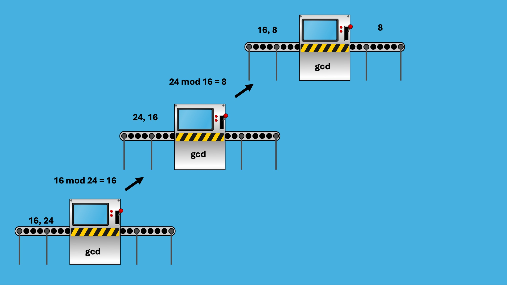
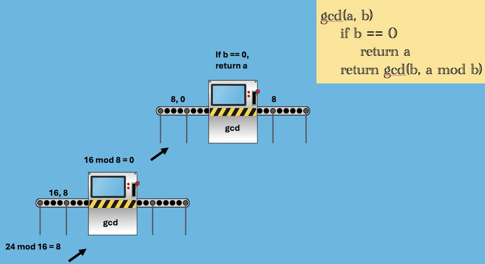

+++
title = "How Euclid Solved Programming 3,000 Years Ago"
hook = "Quite the baller if you ask me"
image = "./Euclid.png"
published_at = 2024-05-02T18:33:36-06:00
tags = ["Programming", "Science"]
youtube = "https://youtu.be/fbfHSW_qy_Y"
+++

## Greatest Common Divisor

Euclid in about 300 B.C. devised an algorithm for finding the greatest common divisor of two whole numbers

*8 is the Greatest Common Divisor of 16 and 24*

## The slow way

One way to find the GCD of two numbers is to list out all the factors of each number, and iterate through each list to find the highest common number

*The slow way of finding the GCD of two numbers*

## The fast way

Let's break this down:

- `gcd()` symbolizes a "function call"
- The "function" is _itself_
- This is call **Recursion**

*The fast way to compute the GCD of two numbers*

## GCD broken down

This is where Modular Arithmetic is useful

Euclid's algorithm calls for swapping `a` for `b` in the function call (i.e. the "recursive" call), and having the second argument be:

- `a mod b`

This means, that if `a` were `16` and `b` were `24`, then `16 mod 24` is just `16`, because `24` is bigger than `16`, so `24` can't divide `16` at all, so the remainder is just `16`

On the **next** call however, `24` is modularly divisible by `16` (it leaves us with `8` left over)

So the next function call paramters are `16` and `8`

*GCD internally working*

*Hitting the "b==0" base case*

## The crazy thing about this algorithm

This **still** remains one of the **FASTEST** ways to get the GCD of two numbers

Even with all our fancy computing power, Euclid had this solved roughly 2-3,000 years ago 😂

What a baller 😎
