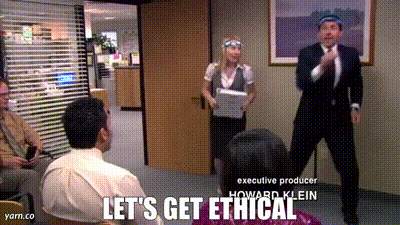

+++
title = "Georgia Tech OMSCS AI, Ethics and Society Review | CS 6603"
hook = "AI on steroids"
image = "Ethics5.jpg"
published_at = 2022-12-28T22:46:49-06:00
tags = ["AI", "Ethics", "OMSCS"]
youtube = "https://youtu.be/wQOSeCC5oss"
+++

## TL;DR

- Easy
- 7 hours per week
- Interesting

*Let’s get ethical!*

## What is Ethics?

> “Ethics is a real discussion of the competing conceptions of the good.  
> This is just the corporate anti-shoplifting rules.” 
> - Oscar Martinez

Okay what **really** is ethics?  
It’s basically how to treat all users and people fairly

## Graded course material

- 5 Homework Projects
    - Some programming involved
    - 8% each
- 2 Written Crituques
    - Short 1-2 page essays
    - 5% each
- 6 Case Studies
    - Quick survey-type responses
    - ~1% each
- 4 Exercises
    - Simple 1-paragraph responses
    - ~2% each
- 2 Exams
    - 1 online, 1 take-home
    - 10% each

## Homework Projects

### Facebook

In this assignment you will pull the advertising data that Facebook (or any other social media platform) has on you personally  
You will then categorize the different companies into things like “Clothing and Apparel”, “Automotive” etc.  
You then create a [data flow graph](https://sankeymatic.com/build/) of the different accuracies of the advertising for you personally

You do not need a Facebook account for this  
But it definitely makes things easier (I used my wife’s account LOL)

*An example data flow graph*

### Stats 101

Given a dataset, you will analyze the statistics of it by separating out the “[protected class](https://en.wikipedia.org/wiki/Protected_group) variables” and make some graphs and charts about them  
You will be using:

- python (most likely)
- matploblib
- pandas

The graphs can be tricky to get right on matplotlib but other than that the assignment is pretty straightforward

*Just some random graphs lols*

### AI/ML Parts 1 & 2

In this project (2 parts) you will first:

- Download a “toxicity” in comments datasets, actually really interesting
- Try to find trends in the data, like gender, age, race etc.

In part 2 you’ll:

- Use word-embeddings to find bias in words
- Word embeddings are cool! Read more about them here: [The Illustrated Word2vec](https://jalammar.github.io/illustrated-word2vec/)

Imagine you can have words, and add them together, to create new meanings  
Such as female + royalty = queen  
You can literally do this with word embeddings [1]  
Problem is there are biased meanings in words today, so you’ll investigate that

*Word embeddings visualized courtesy of Jay Alammar*

### Fairness and Bias

You will find a dataset that has to do with a protected class  
You will then split the data into “privileged” vs “unprivileged” groups and analyze using:

- Disparate impact
- Statistical difference parity

**Matplotlib** is your friend!  
It will help you render all the graphs you need  
One hack a student found in my semester was to inspect the website for the AI 360 fairness assignment to [make your graph](https://coolstercodes.com/wp-content/uploads/2022/12/render_post.pdf)

*Use Matplotlib for everything in this class*

### Final Project

Here you will take a dataset of your choice and do a bunch of analysis on it  
It does take a while actually, maybe like **15-20 hours**  
It is similar to the Fairness project, but lengthier

- You could always use the [UCI Machine Learning Repository](https://archive.ics.uci.edu/ml/index.php) to get an idea for a dataset
- Start early!

*University of California Irvine’s Machine Learning repository for datasets*

## Written Critiques

These are very short 1-2 page write-ups, about a certain topic in AI:

- You will use the “[Ethical Autonomous Vehicle](https://vimeo.com/236279998)” tool to experience some self-driving car scenarios
- And also use Google’s “[What-If](https://pair-code.github.io/what-if-tool/)” tool to experiment with some datasets

These are very easy assignments, about 30-45 minutes to complete

## Case studies

Case studies are just paragraph responses to prompts, that you comment on for your peers  
Super simple and quick

## Exercises

Even simpler than case studies, just a paragraph or two about a topic in AI

## Exams

- Midterm
    - Canvas
    - Open-note
- Final
    - Take-home
    - **15-20 hours** so start early
    - Programming
    - Similar to final project

## Grade breakdown

- Projects
    - Facebook – 100%
    - Stats 101 – **18**% (didn’t do it)
    - AI/ML – 100%
    - Fairness and Bias – 98%
    - Final project – 100%
- Written critiques
    - Ethical autonomous vehicles – 85%
    - What-if – 100%
- Case studies – 95%
- Exercises – 95%
- Exams
    - Midterm – 82%
    - Final – 100%!

Final score: 89.16% or a **B** 😋

[1] Jay Alammar's [word2vec visualization](https://jalammar.github.io/illustrated-word2vec/)
