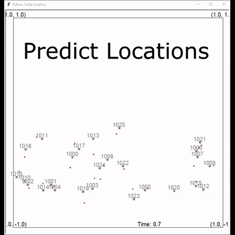
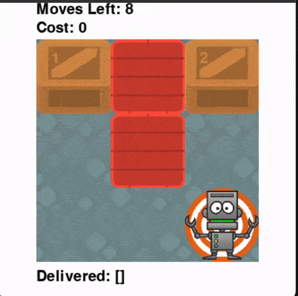
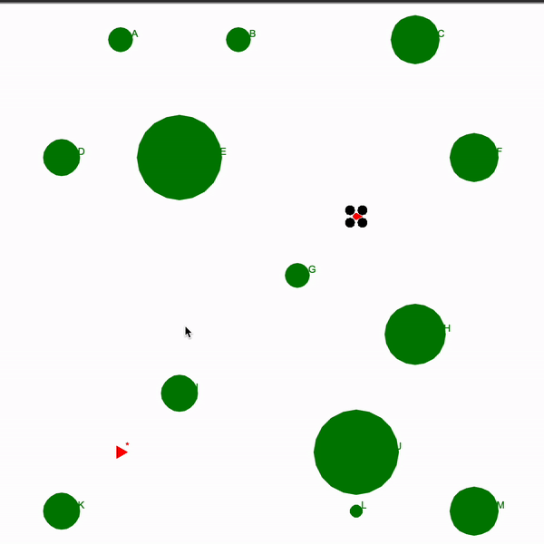
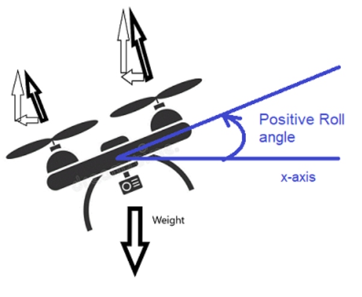

+++
title = "Georgia Tech OMSCS AI for Robotics Review | CS 7638"
hook = "Georgia Tech's Robotics class!"
image = "AIforR2.jpg"
published_at = 2022-12-22T22:31:41-06:00
tags = ["Robotics", "OMSCS", "Science"]
youtube = "https://youtu.be/2dzL429aiT0"
+++

## TL;DR

- Medium
- Avg 12 hours a week
- Cool projects!

## What is AI for Robotics?

AI for Robotics specializes in localization (where are you?), mapping (what is around you?) search (where is the thing you’re looking for?) and control (what do you do to get to your goal?)

## Graded course material

- 4 projects
    - 13% each
- 1 “mini-project”
    - 10% each
- 6 “problem sets”
    - Short coding assignments
    - 3% each
- 2 Exams
- Extra-credit!

## Projects

### Kalman Filter : Meteorites

Kalman Filtering is a way to predict the future locations of objects, given their past locations

*Kalman Filtering at work!*

You will use:

- Linear algebra
- Numpy
- Trigonometry

The [Kalman Filters lecture videos](https://omscs.gatech.edu/cs-7638-artificial-intelligence-robotics-course-videos) are incredibly helpful here, make sure to watch them all  
If you want to get started early I believe [this free Udacity course](https://www.udacity.com/course/artificial-intelligence-for-robotics--cs373) has most of the same material

### Particle Filter : Mars Glider

You will guide a glider around a map using particle filters

*Particle filters locating a glider*

Particle filters is equivalent to “crowd sourcing” a location of an object (lecture videos)  
You generate a bunch of points and slowly begin to choose the most likely points  
You will use:

- Linear algebra
- Statistics
- Trigonometry
- Creativity

I say you’ll use “creativity” because you have to come up with a lot of the specifics yourself, i.e. how many points? What noise level of measurements will you allow? How will you determine an appropriate error? etc. etc.  
My advice is to watch the lecture videos once through before you even start coding or reading the spec, to get a high-level understanding first

I only got 63/100 on this project but still managed to get a B in the course (start early!)

### Search: Warehouse

Here you will program a robot to search the room optimally for boxes

*Search in action*

You will use:

- Cartesian plane
- Planning
- For-loops

This project isn’t too bad, but it takes time  
Make sure to understand what your robot should do on paper, before programming  
The lecture videos are almost verbatim what you need ([lecture videos](https://omscs.gatech.edu/cs-7638-artificial-intelligence-robotics-course-videos))

### SLAM : Indiana Drones

SLAM stands for “Simultaneous Location and Mapping”, meaning you find out where you are in the world, while you map out what’s in the world

*SLAM at work!*

There are a few things you should know going into this (from the [lecture videos](https://omscs.gatech.edu/cs-7638-artificial-intelligence-robotics-course-videos)):

- Linear algebra
- Numpy
- Trigonometry

It’s a bit difficult to understand the linear algebra needed for this project, so I would definitely suggest taking some extra time before you start coding, to do an example out by hand like Prof. Thrun does in the videos.  
That being said, it is by far the coolest project, because this actually has applications in the **real world**.

## Mini-project

### Drone PID Controller

Here you will be controlling a drone’s tilt (i.e. roll angle) and thrust to get it to the goal  
PID is a fancy term which stands for “Proportional-Integral-Derivative”  
Essentially what it means that when you add a little bit of thrust or tilt, that little bit will affect the next amount of thrust or tilt you give

*Roll angle and thrust*

This project follows the lecture videos very closely, which is nice  
You just have to fill out a couple of formulas in code, but they give you the formulas in the videos  
You can also earn extra credit on this project! Which I did by getting an extra 0.22 percent on it 😎

## Problem sets

Problem sets are short coding assignments you do while following along in a lecture video  
They are quite literally “copying” (i.e. transcribing) code from the lecture videos into your python file and submitting it  
So very easy and informative at the same time

## Exams

The exams are great:

- 5% of final grade (midterm) or 10% of final grade(final)
- 15 questions (midterm) or 30 questions (final)
- You get **two tries** for each exam!
    - Best score is kept

The exams together are worth roughly 1 project  
It’s <u>easy points</u>, so study up and get that good grade!

## Extra credit!

Yeah this class is great, here are all the ways you can get extra credit:

- Participate in bi-weekly “Hardware or research challenges”
- Excel in Piazza posts and helpfulness
- Get extra points on projects

I personally did not get extra credit (except for that one project where I got 0.22 points of extra credit 😎)  
But it is great that they offer the option

## Grade breakdown

- Projects:
    - Kalman Filters: Meteorites – 95%
    - Particle Filter: Mars Glider – 63%
    - Search: Warehouse – 82%
    - SLAM: Indiana drones – 88%
- Mini project:
    - Drone PID controller – 100.**22**% 😎
- Problem sets – 100%
- Exams:
    - Midterm – 80%
    - Final – 64%

Final score: 85.56% or a **B** 😎
