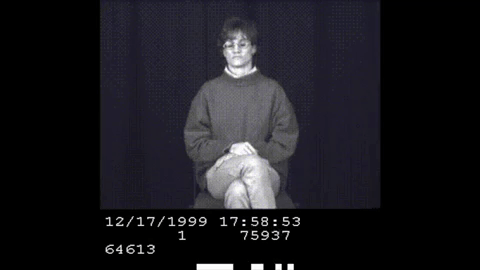

+++
title = "Georgia Tech OMSCS Artificial Intelligence Review | CS 6601"
hook = "Georgia Tech's AI class!"
image = "AI2.jpg"
published_at = 2022-10-01T22:33:33-06:00
tags = ["OMSCS", "AI"]
youtube = "https://youtu.be/OQ74VZHpAUU"
+++

## TL;DR

- Medium-Hard
- Avg 20 hrs per week
- Get a free pass on 1 of 6 projects

## What is Artificial Intelligence?

Artificial Intelligence (AI) is basically getting computers to do human tasks.

## Graded course material

- 6 projects
    - 12% each
    - 1 of them is dropped from your grade
    - Very programming heavy
- 2 exams
    - Midterm is 15%
    - Final is 20%
- Extra credit
    - 2 of the projects offer extra credit
    - My semester there was an additional extra credit opportunity for watching Meta lectures
- Curved grading
    - Above the class median is an A
    - 1 standard deviation below the median is a B

## Project overview

### Tri-directional search

In this project, you’re given a map of cities, and start by implementing some search algorithms to get from point A to point B

Algorithms used are:

- Breadth-first search
- Uniform cost search
- A* search
- Bidirectional uniform cost search
- Bidirectional A*
- Tridirectional search

Breadth-first search  
Let’s say the graph of cities is like in the picture below, the paths explored would be:

- A->B
- A->D


*Breadth first search example*

Uniform cost search  
If given the blow graph for uniform cost search, the paths explored would be:

- A->B (5)
- A->B->C (6)
- A->D (6)

With uniform cost search, you just take the cheapest path every time.  
It is guaranteed to find the shortest path from point A to point B, but is very costly with big graphs


*Uniform cost search example*

A* search
With A* search, you have some kind of estimate as to how far away a point is from it’s destination (h).  
You then combine how far it took you to get to your current point (g), plus the estimate to your destination, to choose the next point to explore.

In the below example, the paths explored would be:

- A->B (g=5, h=7, total cost of 12); A->D (g=6, h=3, total cost of 9)
- A->D->E (g=13, h=0, total cost of 13) but we’re not done yet, the algo ends when goal is popped off, not put on
- A->B->C (g=6, h=3, total cost of 9)
- A->B->C->D (g=9, h=3, total cost of 9); A->B->C->E (g=9, h=0, total cost of 9, and update to use this path, rather than A->D->E)
- A->B->C->E


*A* graph example*

Bidirectional uniform cost search  
Basically, you do uniform cost search, but from the start point AND from the end point, and see where the two paths meet in the middle

Bidirectional A*  
Same thing, you do A* from start and end and merge paths where they meet in the middle

Tridirectional search  
This one’s a doozey, my advice is to not use a greedy approach  
Use a switch-approach, meaning expand start path, then expand the end path, alternating back and forth until they overlap  
And “overlapped” means when your “popped” or AKA “explored” maps meet, not simply when your “frontier” maps meet  

### Isolation

I did not do this project since I was so time-crunched for work 😋

- The github repo for it (public to GT students) is here: [omscs6601/assignment_2](https://github.gatech.edu/omscs6601/assignment_2)

### Bayes Nets

Probability based, implementing the Baye’s rule


*Baye’s rule*

You’re given a set of “alarms”, that only sound on certain conditions; i.e. “The alarm has a 15% chance of sounding when the temperature drops below freezing”

I would read very carefully the documentation here: [https://pgmpy.org/models/bayesiannetwork.html](https://pgmpy.org/models/bayesiannetwork.html) as it explains one example using grades very well


*Documentation from https://pgmpy.org/models/bayesiannetwork.html*

Noice how all the columns add up to 1  
So this is saying “Given that the class is easy, the student is smart, the chance the student gets a grade C is 80%”  
You just have to make similar tables for the problem they give you  
For example, if the information given to you were “It is rainy, 90% of the time”, you might make a table like:

```python
rain_distribution = TabularCPD('rain', 2, values=[[0.10, 0.90]])
```

So `False` value comes first (10%), `True` value comes second (90%)

You also do a soccer game matchup problem, which is just bigger tables. Then you sample from those using a couple algorithms.

You only get 5 submissions on this project so choose carefully.

### Decision Trees

This is your typical decision tree, basically like this picture:


*Super simple decision tree*

### Gaussian Mixture Models

Prepare yourself

In this project, you are clustering pixels in an image, and are given a few algorithms to implement via a research paper:

- k-means clustering
- Gaussian mixture models
- Bayesian information criterion

K-means clustering  
For K-means clustering, you are going to use [numpy](https://numpy.org/) to sample random points from a given array (pixels)  
You then take those points, and use them as cluster centers  
Gradually moving those cluster centers around, until they stop changing


*Clustering results example from what you’ll implement*

K-means clustering : continued  
Next you’ll cluster a picture, then segment the image, by making all the pixels that belong to a cluster, that mean cluster value


*Segmentation with k=2 and k=4*

Multivariate Gaussian Mixture Model  
Instead of a traditional 2D gaussian curves, here you’ll be finding the probability that a pixel belongs to a certain **Multivariate** Gaussian distribution. Then adjusting the distributions in an iterative step, kind of like in k-means clustering

You can start going through the documents in the assignment (public repo for GT students: [omscs6601/assignment_5](https://github.gatech.edu/omscs6601/assignment_5))

I would start by reading:

- `read/gaussian.pdf` to understand how multivariate Gaussians work
- Watching [Clustering (4): Gaussian Mixture Models and EMs](https://youtu.be/qMTuMa86NzU) on YouTube

First thing you’ll need to implement is finding the covariance matrix of a multivariate gaussian distribution  
Basically implementing the following equation found in `read/em.pdf` of the ^ github repo


*read/em.pdf covariance equation*

Next you will choose random points from your picture, and make the covariance matrix for each point, as well as component mixing coefficients.


*Component mixing coefficient from read/em.pdf*

You have to implement a lot more functions, while following the papers and reading a bunch of numpy documentation.  
I myself took a lot of help from two posts in my semester’s Ed stem forum, which really explained well what you want to be doing.  
You’ll probably just have to ask your teammates and fellow students for help on this one, the `prob` and `Estep` functions are gnarly.

In the end, you end up with this though 🙂


*Multivariate Gaussians, yaaaay..*

The last part of this project is just convergence criteria.

Bayes Information Criterion penalizes models that have a lot of parameters, and you implement it in your algoritm: [Bayesian_information_criterion](https://en.wikipedia.org/wiki/Bayesian_information_criterion)

### Hidden Markov Models

In this assignment, you will make state machines (models) that compute the probability of one hand movement type from one stage to the next, to predict a word that someone is signing in sign language.


*A video representation of HMMs*

You track the y coordinates of the hands of someone signing, and those coordinates are the input to your model.


*An HMM diagram*

You can also start reading through this repository (through GT credentials) at [omscs6601/assignment_6](https://github.gatech.edu/omscs6601/assignment_6)

It’s not that much code, just filling in probability tables according the the sheet you are given.

You only get **10 submissions** on gradescope so choose wisely. I think it took me 4-5 tries.

## Exams

The Midterm is worth 15% of your final grade

- I got 65% on it

The Final is worth 20% of your final grade

- I got 62%

## Grade breakdown

Here’s what I got in the class Spring 2022

- Assignment 1 – 92%
- Assignment 2 – 0%
- Assignment 3 – 81%
- Assignment 4 – 100%
- Assignment 5 – 92%
- Assignment 6 – 100%
- Midterm – 65%
- Final – 62%

Final grade: **83.07%** of a **B** grade


