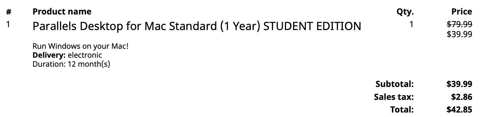
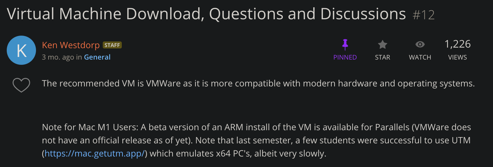
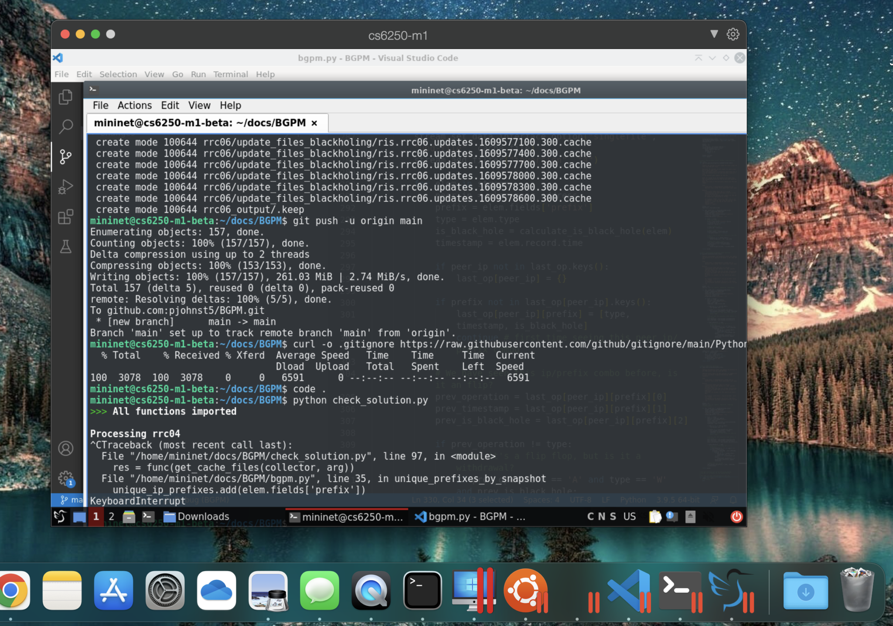
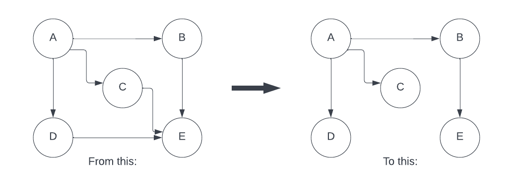
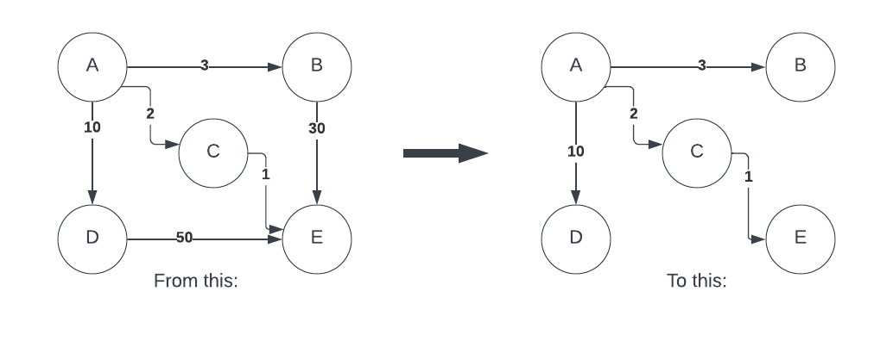
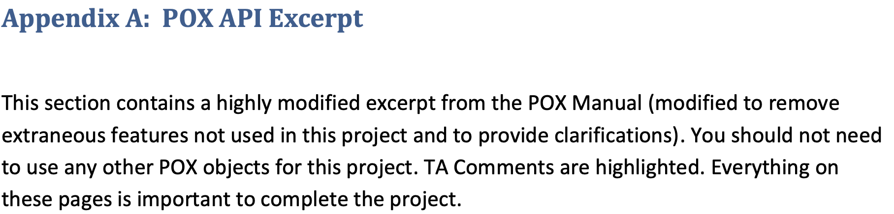

+++
title = "Georgia Tech OMSCS Computer Networks Review | CS 6250"
hook = "Georgia Tech's Computer Networks class"
image = "./Networks3.jpg"
published_at = 2022-08-07T22:42:50-06:00
tags = ["OMSCS", "Networking"]
youtube = "https://youtu.be/hAv4qNdmNmg"
+++

## TL;DR

- Easy
- Avg 5-7 hrs per week (if that)
- Cannot work on assignment ahead of time
    - Assignments are locked until week of due date
- Took it during Summer 2022, easily manageable during shorter term
    - Would be a good 2nd class candidate during Fall/Spring

## What is Computer Networks?

In this course, you’ll learn how basic computer networks, work (ha ha 😅)

## Graded course material

- 2 Exams
    - Closed-notes
    - Each exam is 15% of final grade
    - Difficutly level: Easy, they mirror the quizzes (which are open-note) closely
- 12 Quizzes
    - <u>Open</u> notes
    - See correct answers after taking them
    - Very similar to the exams
    - Each quiz is 0.83% of final grade
    - Difficutly level: <u>Extremely easy</u>, can just ctrl+f in each Canvas module for the answers
- 4 Projects
    - Difficulty level: Easy, each lab comes with very detailed instructions
    - Time spent on avg per project: 5 hrs
    - Each project is weighted ~15% of final grade
    - Unlimited number of submissions on Gradescope
        - **Except** SDNFirewall, you get 1 submission for that through Canvas, but can test it locally first
- Extra-credit
    - This class offers a 3% extra-credit project
    - I did not do it, but it’s a lot of extra credit if needed!

## Project overview

### Course Virtual Machine Setup

This was not a graded-project, but was necessary for 2/4 projects.

Basically, you just need to follow some instructions to download a Virtual Machine image that the TA’s made for the class

I used a <u>Macbook Pro with an M1 chip using Parrallels Desktop</u>, and found no issues

Parrallels Desktop student edition set me back $40.

For non-M1 chips, setup was free and easy through VMWare

*Parrallels Desktop invoice*

*Non-M1 chip options*

*Parrallels Desktop on Mac with an M1 chip*

### Spanning Tree project

The idea behind spanning tree, is to find the minimum spanning tree between a graph of nodes:

*Spanning Tree example*

You are given each node’s:
-  ID
- Neighbors

The algorithm is given to you in the lectures, and covers the logic completely.

Took about 6-7 hours to complete, including lecture reading/video watching.

You get an unlimited amount of submissions through Gradescope.

### Distance Vector Routing project

Basically the same as Spanning Tree, but now the edges have weights, but now you want to find the least-costly paths between nodes that spans the graph:

*Distance Vector*

Unlimited submissions allowed on Gradescope

Most of the logic is in the videos/reading

Total time spent was probably like 6-7 hours, including reading/video watching.

### SDN Firewall project

This was implementing a firewall through code that you write

The nice thing is, that you just give some settings to a code package called [`pox`](https://noxrepo.github.io/pox-doc/html/), and pox handles the actual filtering/selection of packets for you.

**PRO TIP** ONLY read the appendix A for `pox` guidelines, it has everything you need to know to complete the project:

*Only read this appendix (in project description) for pox related questions, it is all you need*

Total time spent on this one was more like 10 hours including reading and video watching.

Are only allowed <u>one submission</u> on Canvas, but you can test your code locally through a given code package in the repo.

### BGP Measurements

This one is filtering out packets of interest from `rib` files that have historical data of BGP records being passed around the internet.

It’s really just a leetcode-type problem of using sets, hashmaps, for-loops etc.

Total time was about 4 hours, including reading.

Unlimited amount of submissions on Gradescope

## Exams and Quizzes

Exams are fairly straight forward, and you can easily get an A in the class by getting 100% or close to it through Projects, then not really needing a good score on exams.

My case was:

- Projects: 60/60%
- Exams: 24.71/30%
- Quizzes: 6.27/10%

Total grade: 90.98% or an **A**
