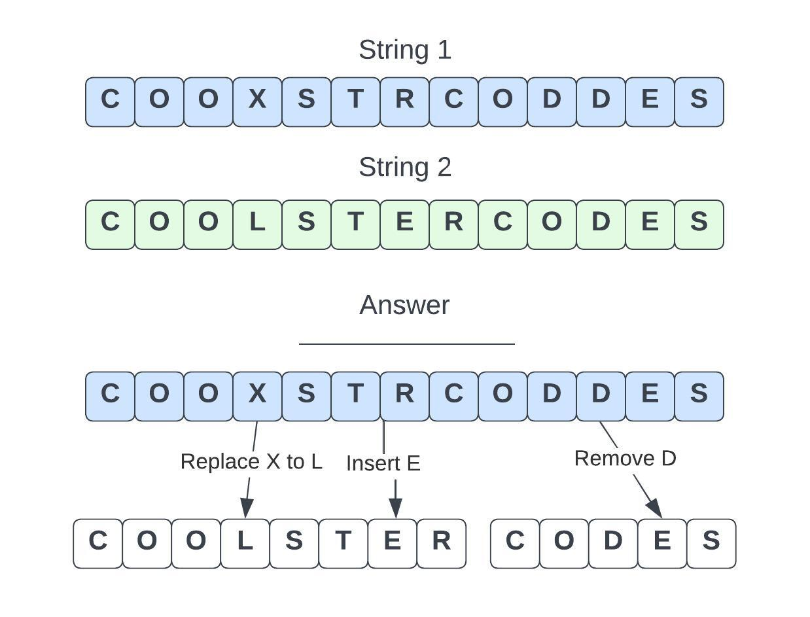
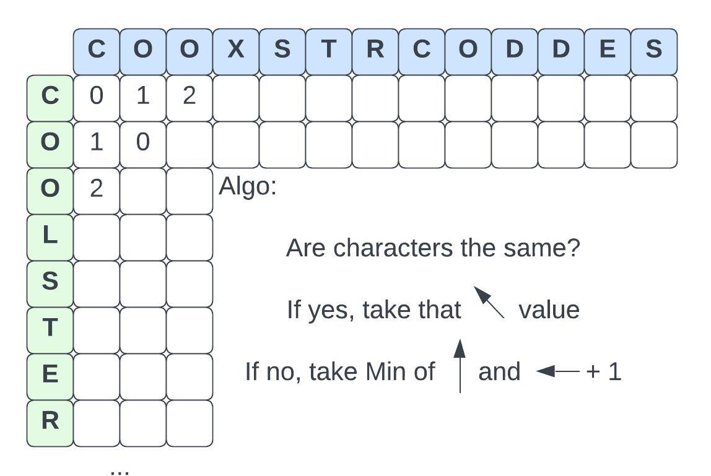
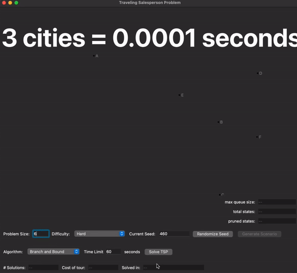
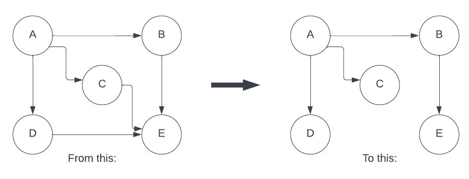
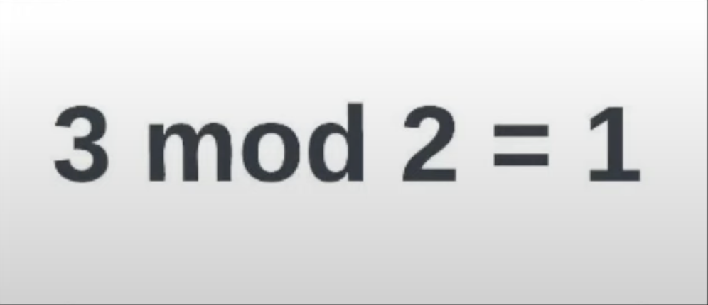

+++
title = "Georgia Tech OMSCS Graduate Algorithms Review | CS 6515"
hook = "Georgia Tech's dreaded Grad Algos class 😱"
image = "Thumbnail_Grad_Algos-scaled.jpeg"
published_at = 2023-11-10T23:58:21-06:00
tags = ["OMSCS", "Algorithms"]
youtube = "https://youtu.be/MHxGqhAx234"
+++

## What is Graduate Algorithms?

Algorithms is the study of getting computers to do things fast and efficiently 🏃🏻‍♂️🚀

## Graded Course Material

- 8 Homeworks (~%2 each)
- 3 Coding Project (%3 each)
- 3 Exams (%24 each)

## Homework 0: Big-O Notation, Graph Theory and Boolean Logic

This is a self-assessment in how well you know:

- [Big-O Notation](https://en.wikipedia.org/wiki/Big_O_notation)
- [Graph theory](https://en.wikipedia.org/wiki/Graph_theory)
- [Boolean logic](https://en.wikipedia.org/wiki/Boolean_algebra)

## Homework 1: Dynamic Programming

Example: [Edit Distance](https://en.wikipedia.org/wiki/Edit_distance)

- You’re trying to find out how “close” two words are
- The allowed actions are Replace, Insert and Remove

You can solve this using Dynamic Programming


*Example Edit Distance*


*Dynamic Programming way!*

## Homework 2: Graphs and logarithmic

Example: [Traveling Salesman Problem](https://en.wikipedia.org/wiki/Travelling_salesman_problem)

- Try to find the shortest path between cities
- Actually super complicated 😱


*Traveling Salesman Problem visualized*

## Homework 3: Fast-Fourier Transform

- [Fast Fourier Transform](https://en.wikipedia.org/wiki/Fast_Fourier_transform) lets you break apart into pieces things like sound, electric signals etc.
- Sounds like it is super useful for stuff..
- I guess that’s how [Shazam](https://www.shazam.com/home) works.. 🤷🏻‍♂️


*Basically lets you “undo” a smoothie.. but with math.. 🤯*

## Homework 5: Minimum Spanning Trees

This one is about merging two MSTs together, using an algorithm that is efficient and correct


*Minimum Spanning Tree*

## Homework 6: Modular math and RSA

[RSA](https://en.wikipedia.org/wiki/RSA_(cryptosystem)) is an encryption algorithm. It is how many things are “encrypted” these days
- Basically, it comes down to the fact that it’s really hard to find out the two prime numbers that make up a really big number


*Mod.. Now you know RSA!*

## Project 1: Dynamic Programming

Dynamic programming is a way to break up a problem into a bunch of smaller problems that “add back up” to the original problem

Take for example, the Fibonacci sequence

- What is the nth Fibonacci number?

Recursive (slow) way:

```python
def fib(n):
    if n <= 1:
        return n
    return fib(n-1) + fib(n-2)
```

Dymanic Programming! (fast way!)

```python
def fib(n):
    a = 0
    b = 1
    if n == 0:
        return a
    elif n == 1:
        return b
    else:
        for i in range(2, n+1):
            c = a + b
            a = b
            b = c
        return b
```

In this project, you’re solving the [Knapsack Problem](https://en.wikipedia.org/wiki/Knapsack_problem)

## Project 2: Minmum Spanning Tree w/ Kruskal’s Algorithm

Minimum Spanning trees are basically just finding the most direct route from nodes in a graph.

In this project, you’ll use [Kruskal’s](https://en.wikipedia.org/wiki/Kruskal%27s_algorithm) algorithm to find the MST

You’ll have to compute two things:

- Find(p): given the set p, find the **root** node of the set of nodes
- Union(u,v): given two sets of nodes, **union** them into an MST

.png)
*A Minimum Spanning Tree*

## Exams

- 2 Free response questions
- A prompt, followed by your input for an algorithm that satisfies the prompt

## 🚨 OPINION TIME! 🚨

- The content in this class is awesome
- I think this class relies too much on psuedo code
- Some more real code in this class would be great

## Should you take this class?

If you are doing your master’s for personal benefit, and just to learn something new, you may like this class’s lecture videos

If you are doing your master’s to perform well in academia, and kind of like that style of thing, maybe this is the class for you

If you are doing your master’s to get your degree, I would suggest taking the Interactive Intelligence route and skipping this class
