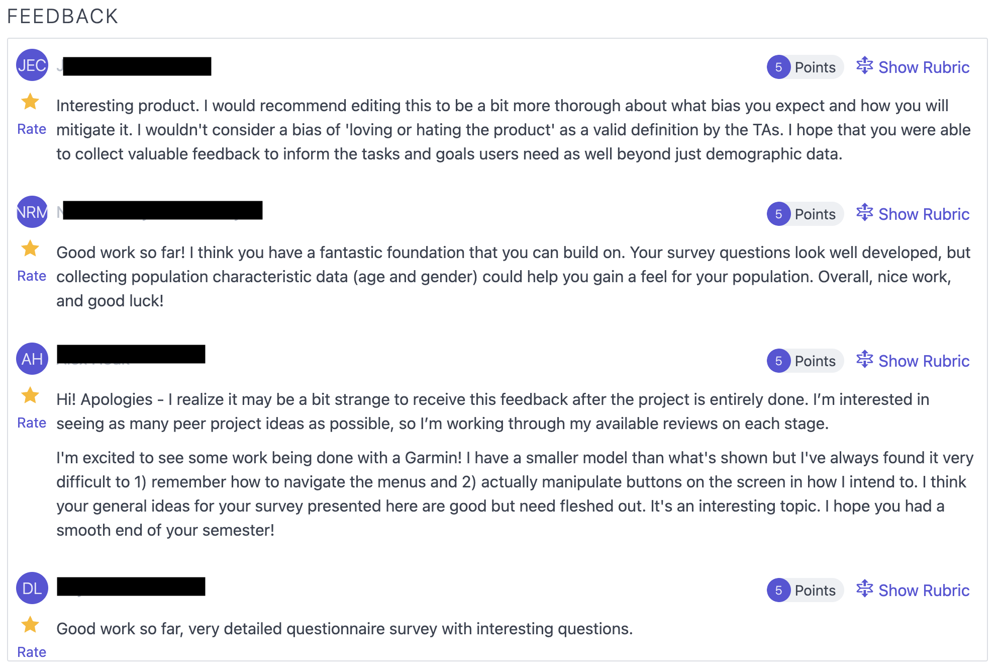

+++
title = "Georgia Tech OMSCS Human-Computer Interaction Review | CS 6750"
hook = "Georgia Tech's HCI class!"
image = "c-me-p0.jpg"
published_at = 2023-01-07T23:40:44-06:00
tags = ["HCI", "OMSCS"]
youtube = "https://youtu.be/meYrgsUo48w"
+++

## TL;DR

- Easy
- 7 hours a week
- No coding!

## What is Human-Computer Interaction?

Human-Computer interaction is the study of how to get interfaces so well made, that humans don’t even notice they’re using them

## Graded course material

- 1 Final project
    - 20% of final grade
    - No programming required
- 5 Principles (P) assignments
    - 4% of final grade
    - Easy
- 5 Method (M) assignments
    - 4% each
    - Tedious
- 42 Peer feedbacks!! 💀
    - 10% of your grade
    - <u>Every</u> assignment, you have to give 3 feedback forms to your peers
- 2 Exams
    - Open-note, open-internet
    - 15% each

## Final Project

Choose an interface (mobile app, website, laundry machine etc.) that could use some <u>redesign</u>  
Ask classmates in surveys or interviews what they do/don’t like about the interface  
Figure out how to “redesign” the interface (on paper only)

- Super easy
- Just need to follow the rubric on Canvas
- No programming required!

*UI design*

## P Assignments

- Super easy
- Just have to do some exercises
- Very interesting

Examples:

- Choose an app that has multiple contexts, like Google Maps, analyze it’s surroundings
- What is a good interface you use day to day and why is it good?
- Select an interface that has bad error handling, what should it do instead?

They are all online you can read them [here](https://omscs6750.gatech.edu/fall-2022/)  
My advice is to <u>follow the rubric</u> on Canvas for each one and you will get 100%

## M Assignments

- Slightly more tedious than P assignments but similar
- Can do them in one sitting

## Peer feedbacks

- 3 per assignment
- Super tedious 💀 just have to give your feedback to three peers’ assignments
- You can make up for them by participating in surveys

*Example feedback I got once Lol*

## Exams

- Open-note, open-lecture videos, open everything!
- You can do “ctrl + f” in required readings while taking the exam

## Grade breakdown

- Final project – 94%
- P Assignments – 80% (didn’t do 1 😋)
- M Assignments – 93%
- Peer feedbacks – 73% (Lols!)
- Exams – 89%

Final score: 87% or a **B** 😎
