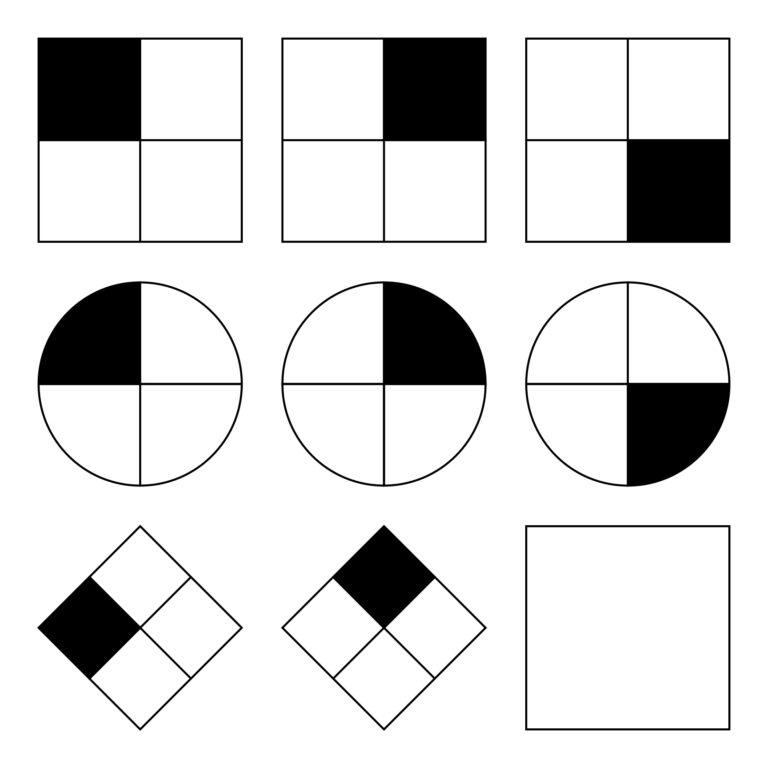
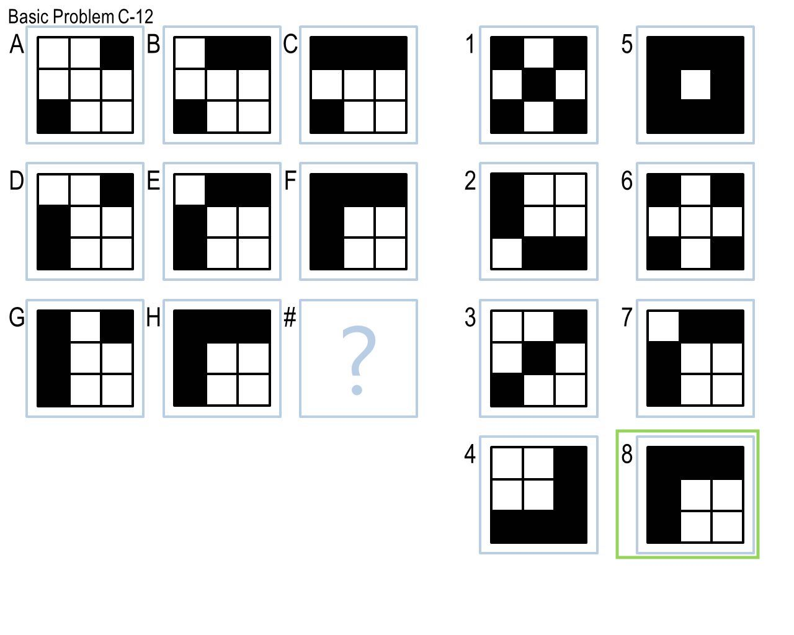
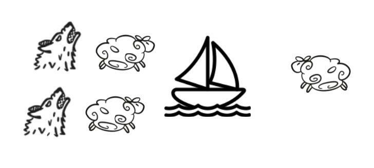
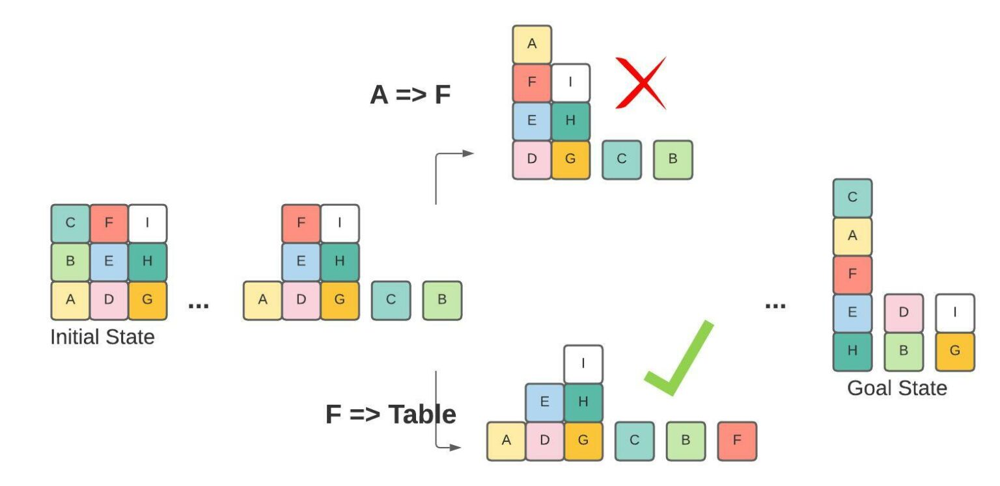
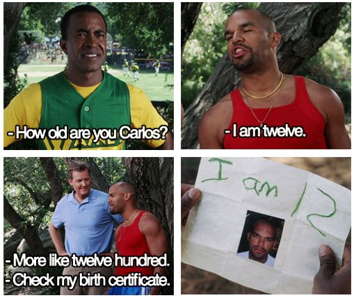

+++
title = "Georgia Tech OMSCS Knowledge-Based AI | CS 7637"
hook = "OMSCS Knowledge-based AI review😎"
image = "KBAI4.jpg"
published_at = 2022-12-12T22:45:40-06:00
tags = ["OMSCS", "AI"]
youtube = "https://youtu.be/mCsmaXxZL60"
+++

## TL;DR

- Easy / Medium
- Avg 12 hours per week
- Can work ahead in this class

## What is Knowledge-Based AI?

Knowledge-based AI models how humans think and reason

## Graded course material

- 1 semester-long project
    - 4 semi-weekly “check-ins”
- 5 “mini” projects
    - Leet-code-esque problems
- 3 homework assignments (papers)
    - Tedious, but not hard
- 2 Exams

## Final Project overview

> **Update!** As of Spring 2025, the final project in this class is now [ARC-AGI](https://arcprize.org/arc-agi) !

Before: You will be solving [Raven’s Progressive Matrices](https://en.wikipedia.org/wiki/Raven%27s_Progressive_Matrices) using AI !

*A simple Raven’s Progressive Matrix problem*

*A more complicated Raven’s Progressive Matrx problem*

*AI is great!*

The correct answer above is **8**, don’t ask me how…

That’s why we have AI! 😅

## Coding

The only code you are given to start out, is how to read in images A, B, C, etc. etc..

The rest, you have to find out in Python ([spec](https://lucylabs.gatech.edu/kbai/spring-2021/project-overview/))

## Strategies

My advice is to use the “[Affine and Set Transformation Induction](https://www.sciencedirect.com/science/article/abs/pii/S1389041712000423)” model from a paper written by Professor Goel himself

The idea is you flip and rotate the images to see which one of the possible answer images is most similar

It’s not very advanced but I was able to get **68/96** puzzles solved with it and still get an A in the class

## Check-ins

You have to turn in your code every-other week and solve x number of puzzles

It counts towards your final grade

## Mini-projects

### Mini-project 1: Wolves and sheep

Get the wolves and the sheep across a river ([spec](https://lucylabs.gatech.edu/kbai/spring-2021/mini-project-1/))  
However, your boat can only hold 2 animals at a time, and wolves can never outnumber sheep on either side

- Recursion is your friend
- Guess and check (i.e. “Generate and Test” in fancy AI vocabulary)

*Get the sheep across without the wolves eating them!*

### Mini-project 2: Block world
Given a stack of blocks labled A, B, C, etc., find out how many moves (and which moves) get the blocks to a “goal” configuration ([spec](https://lucylabs.gatech.edu/kbai/spring-2021/mini-project-2/))

*Example block world problem*

- Priority queue is your friend
- Create a scoring method for “states” of blocks
    - States with blocks that are already in their goal configuration get a higher “score”
    - Blocks that are on the table are higher scoring than blocks that are mis-placed

### Mini-project 3: Sentence reading

Given a simple sentence, try to give the correct answer back as a word ([spec](https://lucylabs.gatech.edu/kbai/spring-2021/mini-project-3/))

- “Carlos is Twelve”
- “How old is Carlos?”
- “Twelve”

*Example question in the project (just kidding, it’s from The Benchwarmers)*

- Tougher and more time consuming than most mini-projects so start early
- Categorize words into adjectives, nouns, verbs etc. etc.
- Find “subjects” and “objects” of sentences
- Find “subjects” and “objects” of sentences

### Mini-project 4: Monster identification

Given a bunch of “monsters” and their attributes, classify a new monster into a category of “True” or “False” ([spec](https://lucylabs.gatech.edu/kbai/spring-2021/mini-project-4/))

- There are many ways to do this
- I did a brute force way, but there are probably better ways

### Mini-project 5: Monster diagnosis

Given a list of diseases and their vitamin levels (Vitamin A defiiciency -> Alphathalasemium), diagnose a new monster ([spec](https://lucylabs.gatech.edu/kbai/spring-2021/mini-project-5/))

- You can do this in a lot of ways
- I did brute force and it worked

## Homeworks

- 3 written homework assignments
- Pretty easy, just tedious

## Exams

The exams are open-note, open-internet  
You just can’t interact with a live person during it

## Grade breakdown

Here’s what I got in terms of scores:

- Final Project – 80.1%
- Miniprojects – 96.6%
- Homeworks – 92.7%
- Exams – 83.4%

Final score: 90.74% or an **A**
