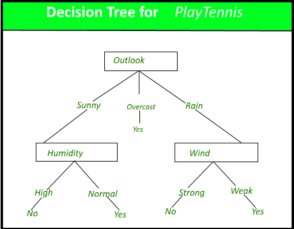
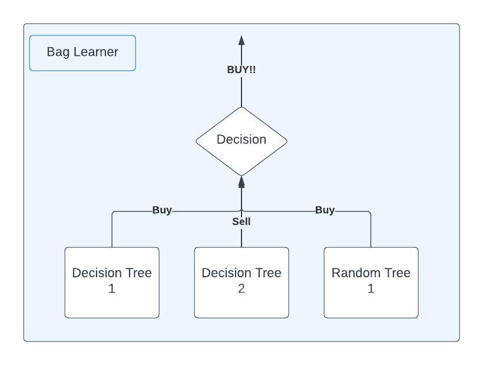
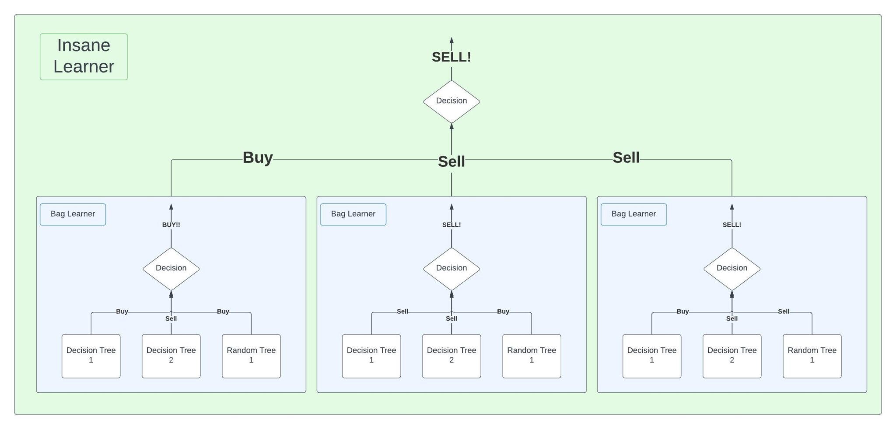

+++
title = "Georgia Tech OMSCS Machine Learning for Trading Review | CS 7646"
hook = ""
image = "thumbnail.jpeg"
published_at = 2023-08-17T23:58:58-06:00
tags = ["Machine Learning", "OMSCS"]
youtube = "https://youtu.be/lFupZlo2pnw"
+++

## TL;DR

- Easy
- 10 hours a week
- Great beginner course and interesting course material

## What is Machine Learning for Trading?

Machine Learning for Trading is how to use Python to build ML models to best trade!

## Graded Course Material

- 8 Projects
    - 10% of Final Grade each
    - Python
- 2 Exams
    - 12.5% of Final Grade each
    - Closed-book, proctoring on

## Project 1: Martingale

In this project you’ll simulate an [American Roulette wheel](https://en.wikipedia.org/wiki/Roulette)

You’ll be proving, that in the long run, the **House always wins** 😏

- Python programming
- Simple statistics
- You implement Prof. Balch’s actual betting strategy when he goes to Las Vegas

The Strategy ([Public Docs](https://lucylabs.gatech.edu/ml4t/fall2021/project-1/)):

- Always bet on black
- When you win, you reset your bet to $1
- When you lose, you **double** your bet
- Cap out at $80 in winnings

The whole idea here is to prove that the Expected Value of consecutive rolls, is negative cash  
Even though you might win every so often


*An European Roulette wheel (you’ll us American which has an additional 00 square)*

## Project 2: Optimize Something

You will find out which stocks are the most **valuable to buy**! (Looking back in history)

- You’ll use Scipy’s [`minimize`](https://docs.scipy.org/doc/scipy/reference/generated/scipy.optimize.minimize.html) function to do this ([Project Specs](https://lucylabs.gatech.edu/ml4t/fall2021/project-2-doc/))
- You’ll implement Sharpe Ratio calculations
- As well as calculating average daily returns and their standard deviations

Pro tips:

- Watch the lecture videos (they are very helpful here)
- [Pandas](https://pypi.org/project/pandas/) 🐼 is your friend!
- Single-purpose functions are your friend! You can re-use them in later projects


*A random stock portfolio*

## Project 3: Asses Learners

In this project, you will make different “learner” models, specifically:

- Decision tree learner
- Random tree learner
- Bag learner (collection of either Decision Tree or Random Tree learners that work together)
- Insane Learner (collection of Bag learners!)

Decision Tree learners are like “if, then” statements  
You give a “flow chart” of what to decide for each input  
In the example Decision Tree below, the question is “Should I play Tennis?”  
In our Decision Tree for this class, the question will be “Should I buy this stock?”


*Example Decision Tree*

Random trees are Decision Trees, but you decide Randomly which attributes to “decide” on, i.e. “Split”  
So in the above example, instead of “Sunny”, “Overcast”, “Rain”, you might randomly decide to categorize by “Tornado”, “Monsoon”, “Earthquake”  
In our Decision Tree, we’re dealing with stock prices, which are **numbers**, so you **randomly** choose which **numbers** to split on i.e. less than $34, equal to $34 dollars, greater than $34 dollars, where the **number** $34 was randomly chosen

Bag Learner is just a collection of Decision or Random Tree learners, where each Decision/Random Tree learner **votes** on what it thinks the answer should be.  
You then take either the most common vote, average vote, etc. to give as the final vote


*Example Bag learner*

Insane learner is just a collection of Bag learners, so the above becomes this:


*Example Insane Learner*

## Project 4: Defeat Learners

For [Project 4](https://lucylabs.gatech.edu/ml4t/fall2021/project-4/), you are now altering the datasets, to try and “trick” or “defeat” one of your learners.  
This means, basically, you’re showing that you understand how these learners actually work

**This builds on Project 3**

- So make sure you get full points on Project 3

You basically just “script-up” some random data using numpy, where one generated dataset works best for the linear learner, and the other works best for decision tree.  
I won’t disclose much about the actual implementation, but just draw on a scatter plot, data (or look them up), that does well for decision tree, and then do the same for linear.

## Project 5: Marketsim

In [Project 5](https://lucylabs.gatech.edu/ml4t/fall2021/project-5/), you will build a “market simulator”, that keeps track of how much money a certain “portfolio” (collection of stocks) will make over time.

Given a list of stocks and their orders (Buy, Sell), and price, you will calculate how much money the person has at the end of the trading season.

```txt
# Input
Date,Symbol,Order,Shares 
2008-12-3,AAPL,BUY,130 
2008-12-8,AAPL,SELL,130 
2008-12-5,IBM,BUY,50 
```

```txt
# Output
2008-12-3 1000000 
2008-12-4 999418.90 
2008-12-5 999754.30
```

The videos go over pretty well actually how to do this, with an in-depth example ([370 – Market Simulator](https://www.youtube.com/watch?v=TstVUVbu-Tk))

## Project 6: Indicator Evaluation

For [Project 6](https://lucylabs.gatech.edu/ml4t/fall2021/project-6/), you’ll be making certain “Indicators”, of how “good” a stock is to buy.  
Some examples are:

- [Simple Moving Average](https://www.investopedia.com/terms/s/sma.asp) (SMA)
- [Percent B](https://www.fidelity.com/learning-center/trading-investing/technical-analysis/technical-indicator-guide/percent-b)
- [Momentum](https://www.investopedia.com/investing/momentum-and-relative-strength-index/)

After you implement code that evaluate’s a stock’s indicator health, you then run a simulation of a stock, and plot the indicator’s value over time

This project includes both coding, and a written report

It’s a little bit tedious and takes more time than other labs, just to get the report right (I did not apparently haha, see grades below)

## Project 7: Q-Learning

Randomly, for Project 7, you will implement a [Q-Learning](https://lucylabs.gatech.edu/ml4t/fall2021/project-7/) robot?? 🤷🏻‍♂️

Not sure why, but anyways, Q-Learning is basically just:

- What state am I (robot) in?
- What actions are available to me?
- Take an action, get a reward 🍪

Now the lectures go over this pretty well I think, but I just happened to have already taken [Reinforcement Learning (CS 7642)](https://omscs.gatech.edu/cs-7642-reinforcement-learning), and basically just used my old code.

This class’s implementation of Q-learning was definitely simpler than Reinforcement Learning’s, so it did not take long.

Check out [what I did](https://www.paulj.pro/projects/rl.html) in Reinforcement Learning though!

## Project 8: Strategy Evaluation

In the last, and final, project in ML4t, [Project 8](https://lucylabs.gatech.edu/ml4t/fall2021/project-8/), you will actually code a STOCK TRADING ROBOT 😱


*Your stock-trading robot*

You will implement 2 “Strategies”:

- Manual strategy (what you can make with your indicators, like is EMA good today? BUY)
- Learner strategy (using either Q-learning, decision tree, or linear learner from previous projects)

It was actually really cool!!

Manual strategy for me worked better than the benchmark strategy (buy and hold)

I also had fun making the decision tree learner work with stock buying/selling

All-in-all, pretty cool project

## Extra-credit: Holy Hand Grenade of Antioch

I have no idea what this is about, other than the name reminds me of the Holy Hand Grenade in the video game, Worms (lols)

## Exams

Midterm:

- 30 multiple choice questions
- 35 minutes
- There’s a study guide and practice exam [here](https://lucylabs.gatech.edu/ml4t/fall2021/exam-1/)

Final (non-cumulative):

- Same exact thing [here](https://lucylabs.gatech.edu/ml4t/fall2021/exam-2/)

## Grade breakdown

- Project 1: 100% 😎
- Project 2: 100% 😎
- Project 3: 86% 😲
- Project 4: 100% 😎
- Project 5: 100% 😎
- Project 6: 65% 🤬 😄
- Project 7: 95% 🤷🏻‍♂️
- Project 8: 92% 🌴
- Exam 1: 76% 💪
- Exam 2: 80% 😎

Final score: 87.6% or a **B** 😎
