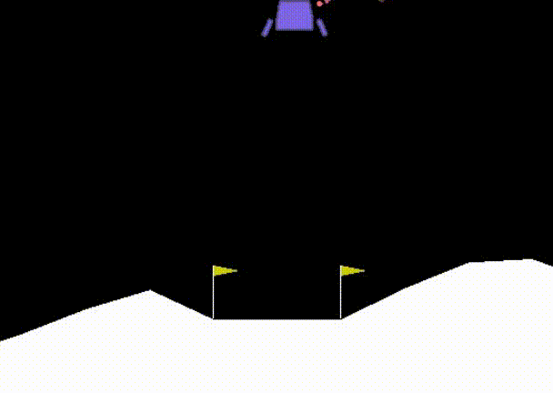
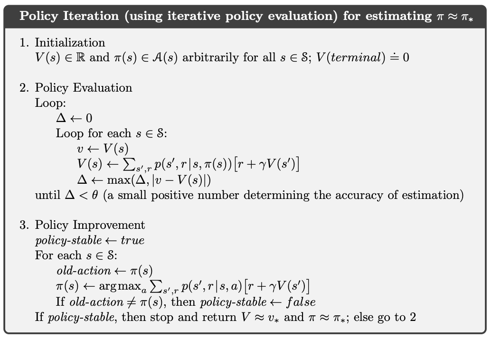
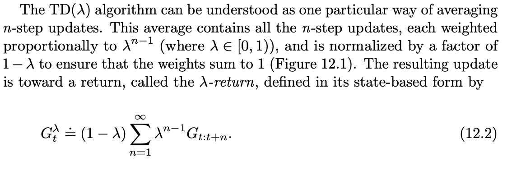
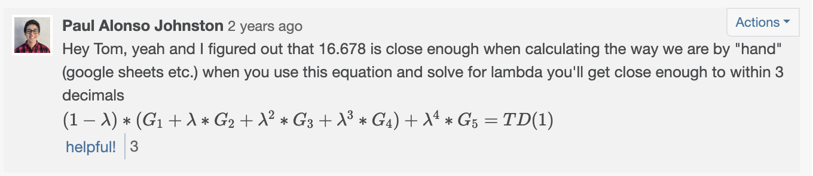
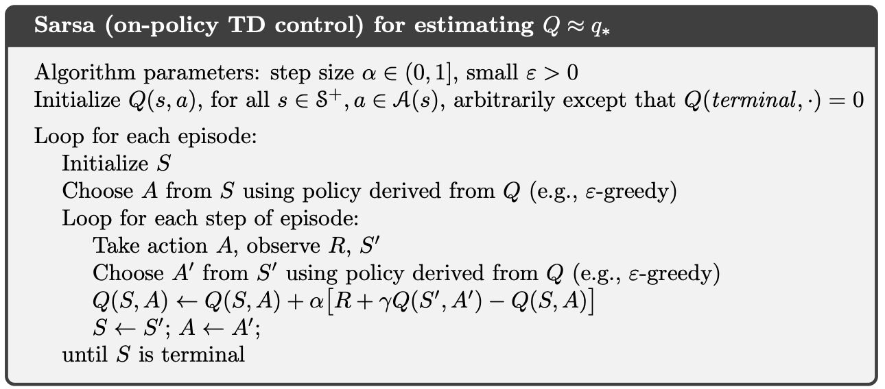
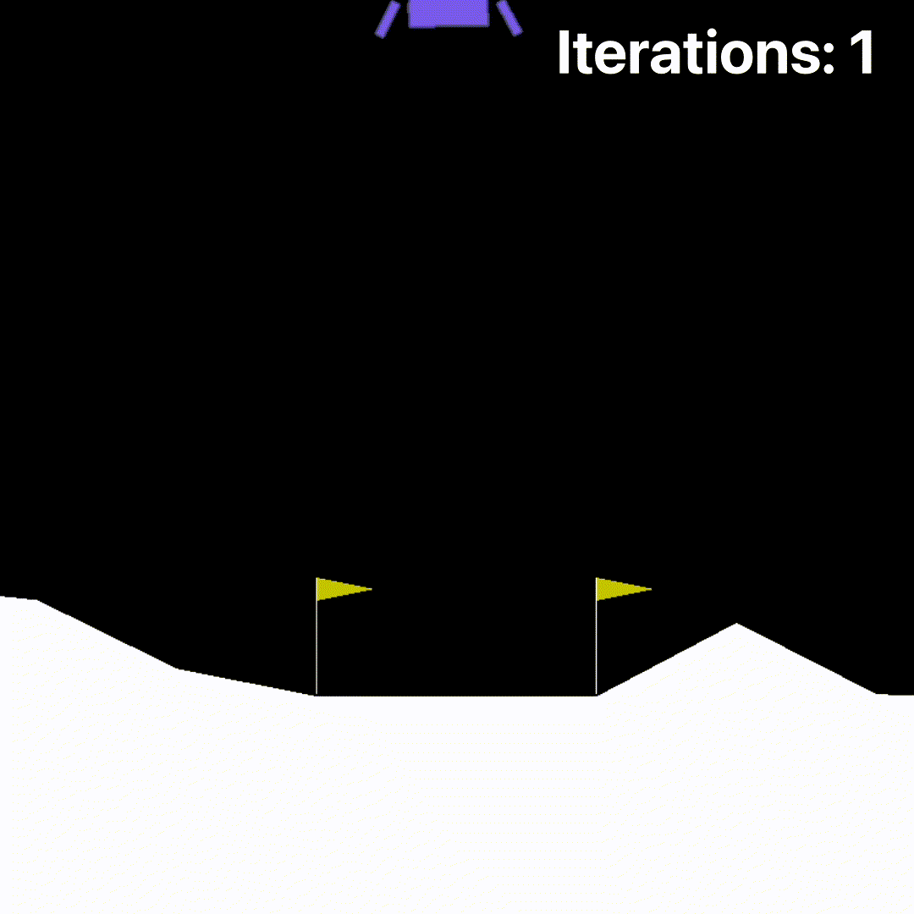

+++
title = "Georgia Tech OMSCS Reinforcement Learning Review | CS 7642"
hook = "Georgia Tech's Reinforcement Learning class!"
image = "Thumby-scaled.jpeg"
published_at = 2023-10-24T00:29:19-06:00
tags = ["OMSCS", "Machine Learning"]
youtube = "https://youtu.be/LEwjFYt4XIQ"
+++

## TL;DR

- Hard
- 20 hours per week
- Big Curve 📉 (68% == B for me)

## What is Reinforcement Learning?

Reinforcement Learning is getting your program to make tiny “updates”, based on rewards it gets in a “world’

*My Lunar Lander Lols*

## Graded Course Material

- 6 Homeworks (5% each)
- 3 Projects (15% each)
- 1 Exam (25%!)

## Homework 1: Planning in Markov Decision Processes

The goal is to find the [Expected Value](https://en.wikipedia.org/wiki/Expected_value) of “points”, you would earn, given an N-sided dice, where some of the sides give you points, and some end the game

You are given some of the context in these lecture videos, but I think the most helpful place is [Chapter 3](http://incompleteideas.net/book/the-book-2nd.html) of the book.

It’s basically just a python script, where you fill in 1 function that does something, and uses Policy-Iteration in Reinforcement Learning.

*Policy Iteration, from the book*

## Homework 2: The ƛ Return

You’re implementing an “update” step for “[Temporal Difference Learning](https://en.wikipedia.org/wiki/Temporal_difference_learning)“

It’s basically just a function that you implement in Python, that follows the Temporal Difference algorithm in the book:

In this equation, you’re basically going to solve for ƛ (lambda)

*The Temporal Difference algorithm in the book*

*I was struggling to get it until I figured this out*

## Project 1: Temporal-Difference ƛ

This one is a lot of reading. You have to read the “[Sutton Paper](https://link.springer.com/article/10.1007/BF00115009)” from 1988 (it’s the original Reinforcement Learning paper basically) and replicate the experiments and results as closely as possible

Then you have to write your own paper (use the [IEEE Paper format](https://www.ieee.org/conferences/publishing/templates.html))

Temporal Difference is basically looking at patterns up until a certain point, and capturing the “roll” of the data.  
If you were trying to predict the weather, you would take into account, how the weather has changed over many days, instead of just looking at yesterday’s weather.

*The paper this project is based on*

## Homework 3: SARSA

[SARSA](https://en.wikipedia.org/wiki/State%E2%80%93action%E2%80%93reward%E2%80%93state%E2%80%93action) is another “update” model for Reinforcement Learning  
It stands for:

- State
- Action
- Reward
- State
- Action

In this homework, you’re an agent, trying to traverse [OpenAI’s Frozen Lake](https://gymnasium.farama.org/environments/toy_text/frozen_lake/) problem, using SARSA

*OpenAI’s Frozen Lake problem on meth*

*SARSA algorithm*

## Homework 4: Taxi (Q-Learning)

[Q-Learning](https://en.wikipedia.org/wiki/Q-learning) is just another “update” algorithm for Reinforcement Learning

In this homework, you’ll be implementing a [Taxi problem](https://gymnasium.farama.org/environments/toy_text/taxi/#taxi) that OpenAI implements for Reinforcement Research

- The goal is to pick up the person and drop him/her off at the desired location, with the minimal steps possible
- It’s pretty amazing! The Q-Learning algorithm just learns which action is best to take in each given scenario

In this homework, you’ll be dealing with a finite-space Q-Learning environment, where the Q-table is a 2-dimensional matrix, of (state x action)

This gets harder in the next lab which is an infinite state space! 😱

*Open AI’s Taxi problem*

## Project 2: Lunar Lander 😱

This one’s pretty cool though, because you’ll get to make a little “robot” that will fly around and try to land in a goal via [OpenAI’s LunarLander](https://www.gymlibrary.dev/environments/box2d/lunar_lander/) in Project

It’s a toughie no doubt, but is super cool once you get it working.  
My suggestion would be:

- Start as simple as possible (keep parameters constant and training short, and watch your lander)
- Keep first training episodes low, so you can watch the learning happen faster
- Tune parameters last, after getting a solid base

I used a [Deep-Q Network](https://www.nature.com/articles/nature14236) because it was used to solve Atari games using an infinite state space, which mapped nicely to this project

I also used the [IEEE Paper format](https://www.ieee.org/conferences/publishing/templates.html) for this project, which got me more points for a more professional look, and will likely get you one too.

*My Lunar Lander*

## Homework 5: Bar Brawl 👊🏼

Given a 2-dimensional array which represents townspeople’s attendance to a bar each evening, you are to find out how likely it is that a fight broke out that evening.

This closely follows a paper called “[Know what it knows: A framework for self-aware learning](https://link.springer.com/article/10.1007/s10994-010-5225-4)“

It’s kind of just math and a few for-loops

## Homework 6: Rock, Paper, Scissors 🪨 📄✂️

This one explores [Game Theory](https://www.cs.upc.edu/~ia/nash51.pdf) using Rock, Paper, Scissors

I remember it was very small coding-wise, but also kind of tricky to get just right

They provide you with some papers to look at and compare with

## Project 3: Correlated-Q ⚽️

In this project you’ll implement a soccer game (yay) and write a paper about it

You just kind of switch out the algorithms used to play the game, and compare the results

It’s pretty interesting but a little time consuming

## Final Exam

The final exam was really hard

I got **31/100** on it, and still managed to get a B in the class

It is free-response

## Grade breakdown

- Homework 1: 100%
- Homework 2: 100%
- Project 1: 63%
- Homework 3: 100%
- Homework 4: 100%
- Project 2: 76%
- Homework 5: 100%
- Homework 6: 100%
- Project 3: 65%
- Final Exam: 31%
