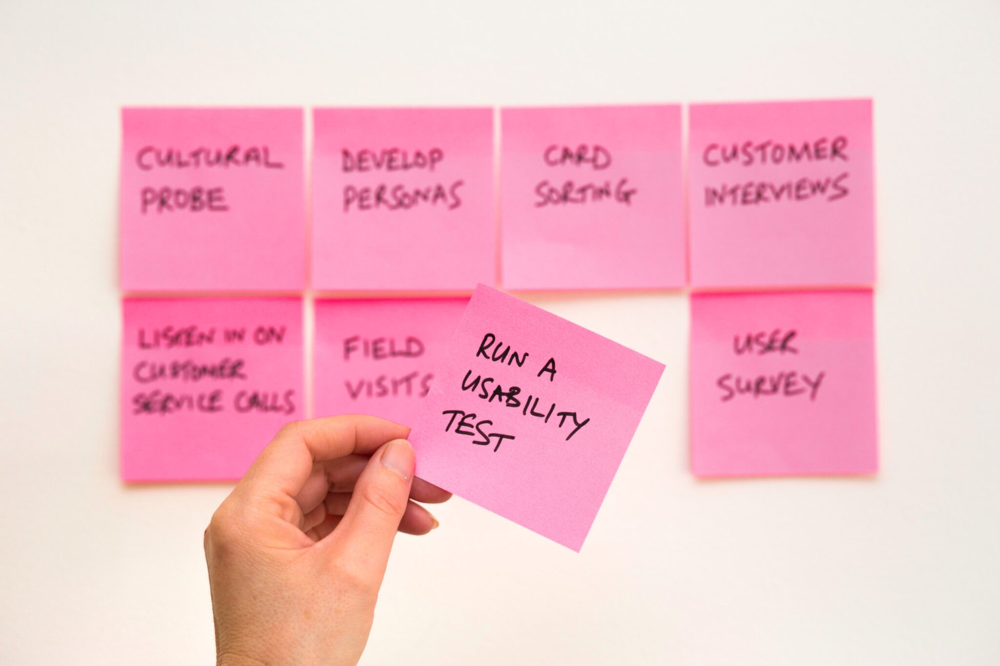

+++
title = "Georgia Tech OMSCS Software Development Process Review | CS 6300"
hook = "Software development class at Georgia Tech"
image = "Thumby_SDP-scaled.jpeg"
published_at = 2023-12-09T22:13:41-06:00
tags = ["Development", "OMSCS"]
youtube = "https://youtu.be/kFn-D2X-1TE"
+++

## TL;DR

- Very nice! 👍🏼 Very relevant material
- 7 hours per week
- Only 1 group project (which isn’t too bad)

## What is Software Development?

Software development is basically just the process in which you build applications/websites/tools using code

## Graded Course Material

- 6 Assignments (Individual)
- 1 Group Project
- 1 Individual project

## Assignment 1: Team Matching Survey

This is just a quick survey about what times of the week you like to work on school projects, what experience you have developing, and any other information you would like the TAs to know about yourself before they match you up with 3 other classmates


*Teamwork!!*

## Assignment 2: Git usage!

This one rocks:

- You actually clone a repository, and begin making changes to it as if you were working with others on a project
- This is SUPER relevant to today’s software engineering, as Git is basically the heart of all software engineering.
- You explore merging, committing and tagging


*Gihtub sneak peek*

## Assignment 3: Basic Java

- You make a simple Java application that “encrypts” messages
- You’ll also end-up **re-using** this code on later so take some time to do it well
- You also make some unit tests


*Not Java, but pretty fancy looking*

## Assignment 4: Android app

- Here you make an Android app, that is the frontend of what you coded in Assignment 3
- It does not need to be fancy


*Android*

## Assignment 5: Software Design

- Here you use UML to design a “Job search” application
- You’ll end up **re-using** this in the Group Project so actually think about it


*Planning*

## Assignment 6: White-box testing

- You’ll solve these unit test “puzzles” related to:
    - Statement coverage
    - Branch coverage
    - Modified Condition/ Decision Coverage
- It’s kind of tricky!


*Testing*

## Group Project 😱

In this project, you are random paired with 3 other classmates to create a **Job Comparison App**:

- A user should be able to enter a job offer
- A user should be able to compar job offers
- A user should be able to change the job comparison algorithm weights

You do it over 5 weeks so it’s not too bad


*Group project time!!*

## Individual Project 🥷🏻 CLI tool

Here you’ll develop a command-line tool that alters text in a file:

- There are flags you can pass into the tool like `-d` (duplicate) or `-k` (keep lines that match) as an example
- You’re supposed to program the tool to actually do what the specs say, and test it well enough
- This is actually **super** relevant to what you do in industry

```txt
Hello, world!
```

```shell
txter -d 1 hello_world.txt
```

```txt
Hello, world!
Hello, world!
```


*Command line*

## Grade breakdown

- Assignment 1: 100% 😎
- Assignment 2: 100% 💯
- Assignment 3: 100% 🔥
- Assignment 4: 100% 🙌🏼
- Assignment 5: 100% ❗️
- Assignment 6: 80% 🤷🏻‍♂️
- Group project collab grade: 99.5% 😎
- Group project overall: 92.6% 🤷🏻‍♂️
- Individual project overall: 94.4 🔥
- Participation: 100%

Overall grade: **A** 😎
