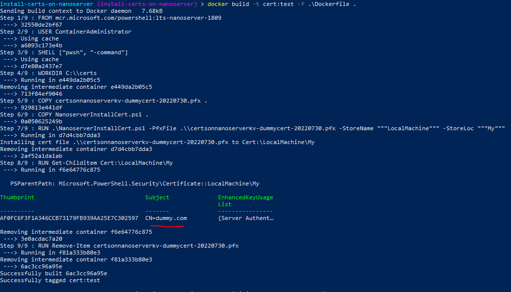

+++
title = "Install Certs on Nanoserver"
hook = "Installing certificates on a nanoserver docker image"
image = "./shield.jpg"
published_at = 2022-07-30T22:34:01-06:00
tags = ["Docker", "Windows"]
youtube = "https://youtu.be/bw0NKTt1dw4"
+++

> [Source code](https://github.com/coolstercodes/Tutorials/tree/main/tutorials/install-certs-on-nanoserver)

## What is Nanoserver?

[Nanoserver](https://hub.docker.com/r/microsoft/windows-nanoserver) is a light-weight Windows Docker container, great for containerizing Windows applications.

## What is a Certificate?

A certificate is a way for a server to verify that the client making the request is legitimate.

Here we will be using a `.pfx` certificate generated through Azure Key Vault

## The Code

The code for this can be found in the below `NanoserverInstallCert.ps1` file and `Dockerfile`.

```ps1
# NanoserverInstallCert.ps1
param(
    [Parameter(Mandatory,Position=0)]
    [string]$PfxFile,
    [securestring]$PfxPass,
    [string]$StoreName = 'LocalMachine',
    [string]$StoreLoc = 'My'
)

Write-Host ("Installing cert file {0} to Cert:\{1}\{2}" -f $PfxFile, $StoreName, $StoreLoc)
$pfx = New-Object Security.Cryptography.X509Certificates.X509Certificate2($PfxFile, $PfxPass)
$store = New-Object Security.Cryptography.X509Certificates.X509Store($StoreLoc,$StoreName)
$store.Open("MaxAllowed")
$store.Add($pfx)
$store.Close()
```

```docker
# Dockerfile
# Use Nanoserver as a base image (with powershell installed)
FROM mcr.microsoft.com/powershell:lts-nanoserver-1809

# Run as admin
USER ContainerAdministrator

# Make default shell powershell
SHELL ["pwsh", "-command"]

# Make a directory to store copy of cert
WORKDIR C:\\certs

# Copy cert to container
COPY certsonnanoserverkv-dummycert-20220730.pfx .

# Copy cert installation script to container
COPY NanoserverInstallCert.ps1 .

# Run cert installation script in container
RUN .\NanoserverInstallCert.ps1 -PfxFile .\\certsonnanoserverkv-dummycert-20220730.pfx -StoreName """LocalMachine""" -StoreLoc """My"""

# Verify that the cert was installed on the container
RUN Get-Childitem Cert:\LocalMachine\My

# Remove copy of cert from container
RUN Remove-Item certsonnanoserverkv-dummycert-20220730.pfx
```

## Running the code

On a Windows machine with Docker installed, run the following to actually do the demo:

```shell
docker build -t cert:test -f .\Dockerfile .
```


*Successful installation of a dummy cert on Nanoserver*
