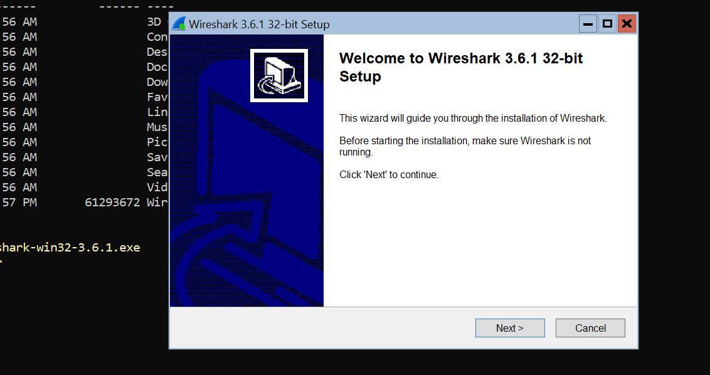
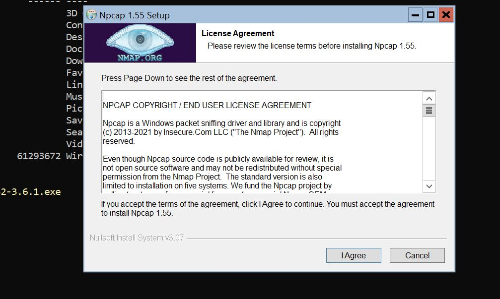
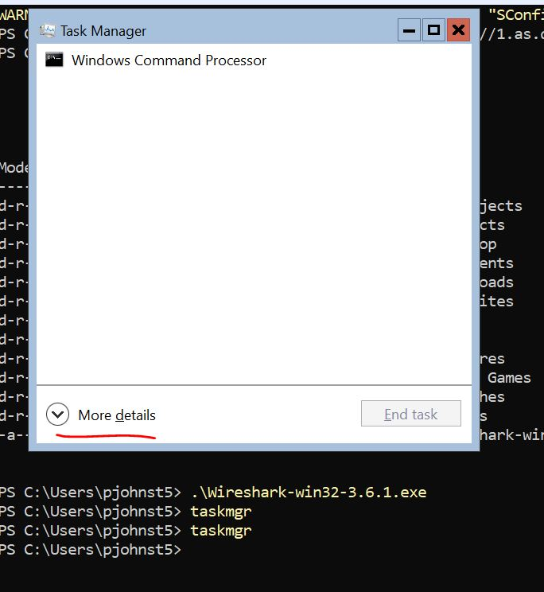
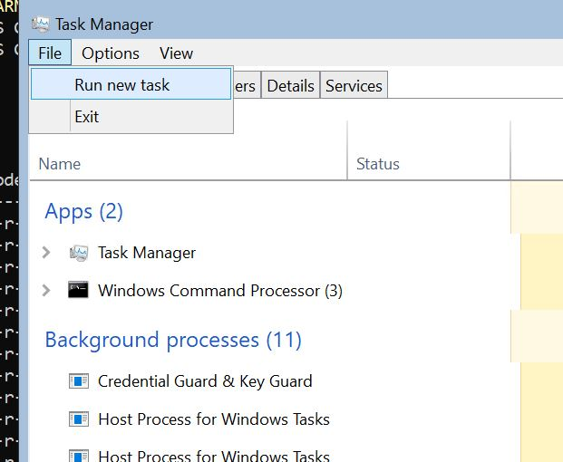
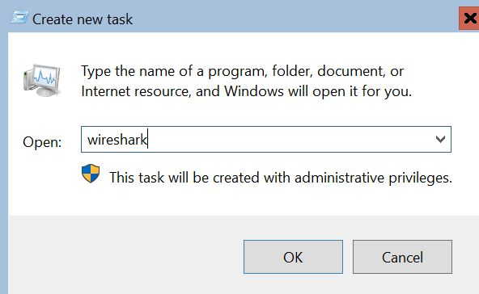
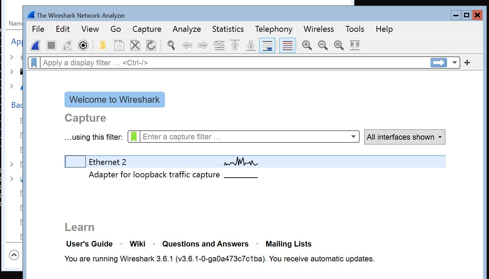

+++
title = "Install Wireshark via Windows Command Line"
hook = "Install wireshark via cmd"
image = "./Wireshark_icon.svg.png"
published_at = 2022-01-12T05:52:59-06:00
tags = ["Windows", "Networking"]
youtube = "https://youtu.be/4JtLr-jGkmk"
+++

Here we will install Wireshark via the Windows cmd line.

This is especially useful if you only have terminal access to your machine

## Download installer

Via Powershell, run the following command to download the 32 bit Wireshark installer

See the full list of downloadables [here](https://www.wireshark.org/download.html)

``` ps
Start-BitsTransfer -Source https://1.as.dl.wireshark.org/win32/Wireshark-win32-3.6.1.exe
```

## Run the installer

Run the installer with

``` ps
.\Wireshark-win32-3.6.1.exe
```

Click “Next” or “Continue” all the way through changing no settings

You will also see a “Npcap” installation window, click “I Accept” or “Continue” all the way through


*Run Wireshark installer*


*Npcap will come up too, click “I Agree” and “continue” through all default settings*

## Run Wireshark

In your Powershell terminal, type `taskmgr` to open Task Manager

Click `More details` > `File` > `Run new task`

Then type `wireshark` and hit enter, you’re done!








*You've done it!*

