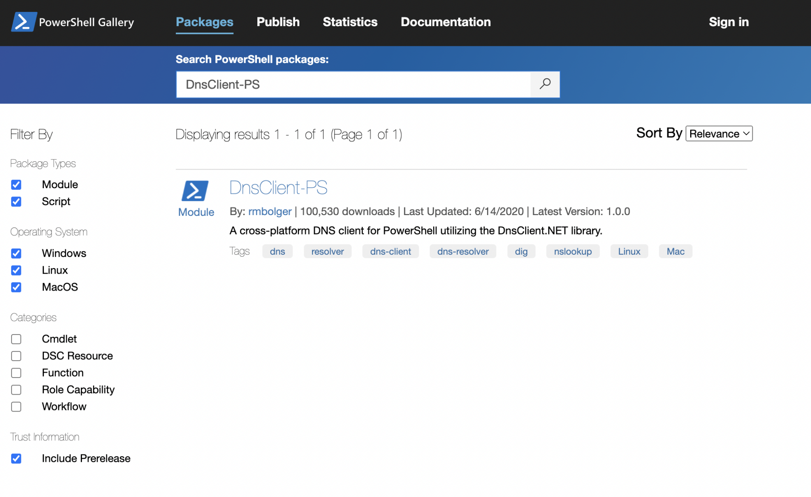
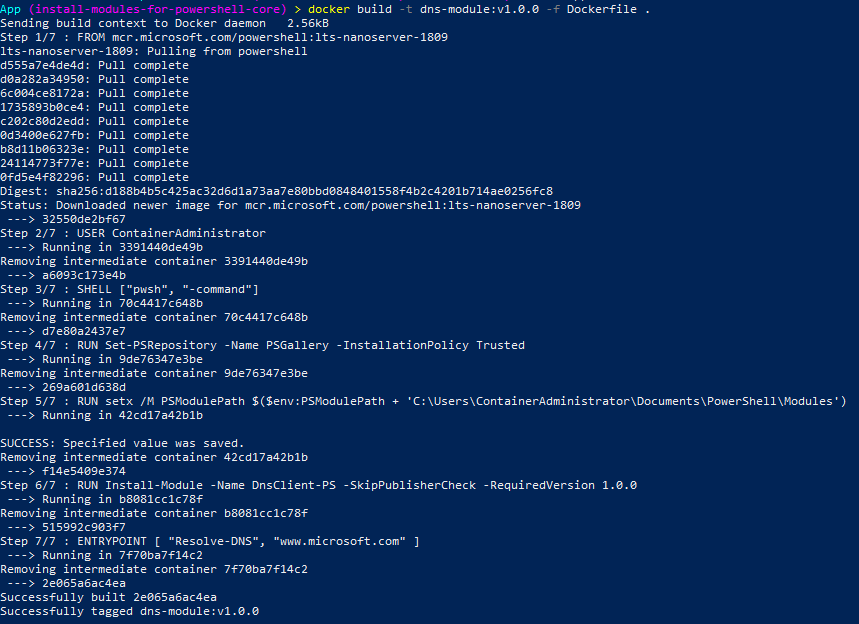
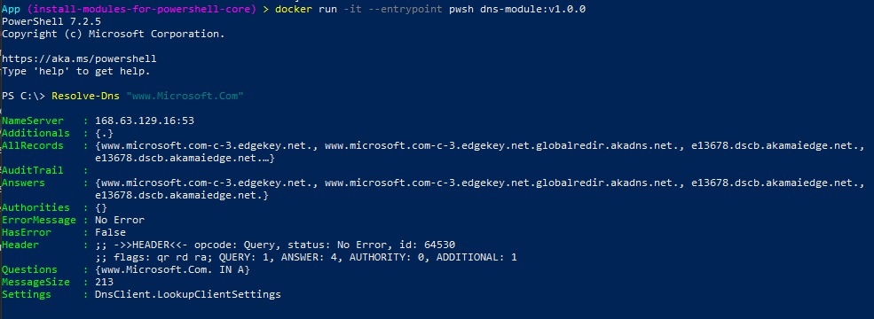

+++
title = "Installing Modules for Powershell Core (pwsh)"
hook = "Installing powershell modules with `pwsh`"
image = "./pwsh.png"
published_at = 2022-07-09T09:15:25-06:00
tags = ["Powershell", "Docker", "Windows"]
youtube = "https://youtu.be/HcNL7BvExY4"
+++

> [Source code](https://github.com/coolstercodes/Tutorials/tree/main/tutorials/install-modules-for-powershell-core)

## What is Powershell Core (pwsh) ?

Powershell Core is a cross-platform version of Powershell.

It is meant to run on Linux, Windows and MacOs

- More info here: [Powershell Core Docs](https://github.com/PowerShell/PowerShell#readme)

## Install Powershell Core (pwsh)

Here will we run Powershell Core in a Docker Container readily available by Microsoft.

`mcr.microsoft.com/powershell:lts-nanoserver-1809` is a docker image readily available on [Microsoft’s Docker Hub](https://hub.docker.com/r/microsoft/powershell) which already has Powershell Core installed.

We will be using this image as a base container image in a Dockerfile later on.

## Browse Powershell Core Modules

Next you can head over to the [Powershell Gallery](https://www.powershellgallery.com/packages?q=DnsClient-PS) to find which Powershell Moduels are available for download.

Here we will be installing the `DnsClient-PS` module to resolve DNS names.


*DnsClient-PS in the Powershell Gallery*

## Install a Module

Here we have created a Dockerfile with a list of commands to both use the `mcr.microsoft.com/powershell:lts-nanoserver-1809` container image and install the `DnsClient-PS` module.

To build the docker image, simply run:

```shell
docker build -t dns-module:v1.0.0 -f Dockerfile .
```

```docker
# Use a readily available powershell core docker image by Microsoft as base
FROM mcr.microsoft.com/powershell:lts-nanoserver-1809

# Run as admin
USER ContainerAdministrator

# Make default shell powershell
SHELL ["pwsh", "-command"]

# Label powershell gallery as trusted
RUN Set-PSRepository -Name PSGallery -InstallationPolicy Trusted

# Add ContainerAdministrator's powershell module location to PSModulePath
RUN setx /M PSModulePath $($env:PSModulePath + 'C:\Users\ContainerAdministrator\Documents\PowerShell\Modules')

# Install powershell core dns module DnsClient-PS
RUN Install-Module -Name DnsClient-PS -SkipPublisherCheck -RequiredVersion 1.0.0

# Run a simple command on startup
ENTRYPOINT [ "Resolve-DNS", "www.microsoft.com" ]
```


*Building the docker image which has Powershell Core in it as well as the DnsClient-PS module in it*

Furthermore, to run Powershell Core interactively inside the Docker container itself, run:

```shell
docker run -it --entrypoint pwsh dns-module:v1.0.0
```


*Running Powershell Core interactively and using the DnsClient-PS module*
