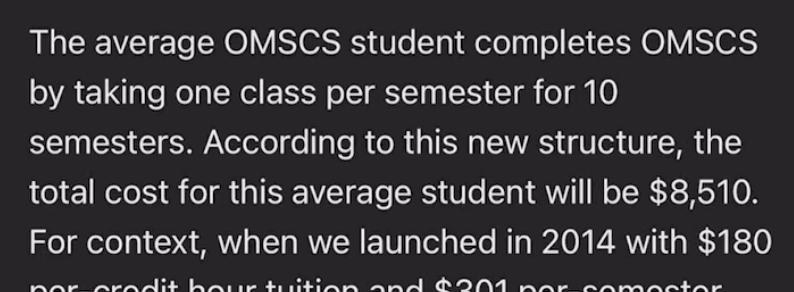
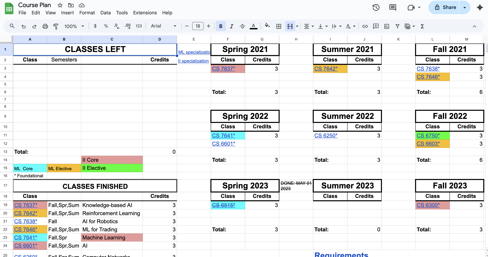
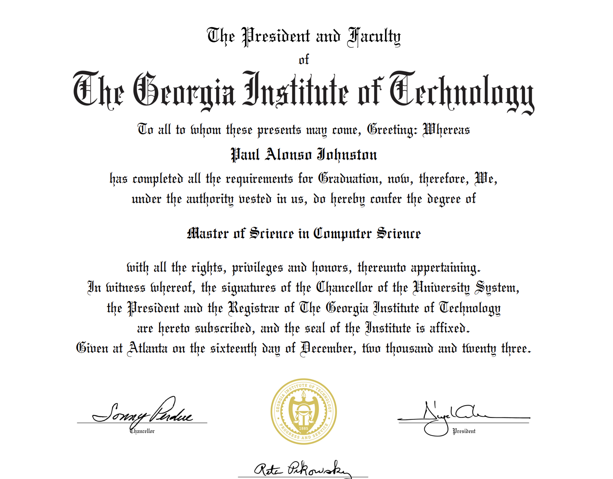
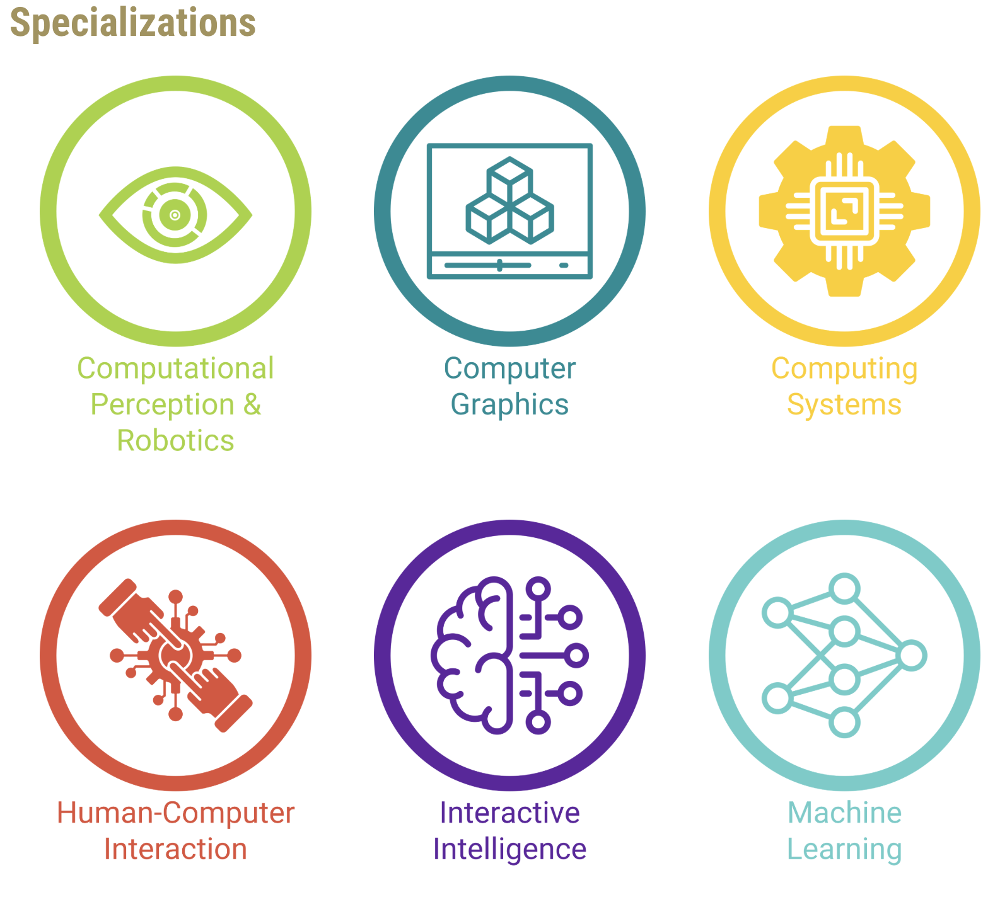

+++
title = "Is Georgia Tech’s Online Master’s Worth It? #OMSCS"
hook = "Is the OMSCS actually worth it?"
image = "Presentation1.jpg"
published_at = 2024-02-27T20:09:18-06:00
tags = ["OMSCS"]
youtube = "https://youtu.be/xz299J0dAnI"
+++

## Cost

The whole thing only costs **$,8000**!  
I'm talking books, tuition, fees, everything for the *whole program*  
Compare that to [UC Berkeley's](https://ischoolonline.berkeley.edu/data-science/) Master's in Data Science where 1 semester costs **$16,000**

Here's a [spreadsheet](./Masters.xlsx) with the details compared

*Different master's programs compared*

## Flexibility

Are allowed to skip 2 semesters sequentially, without re-applying to the program  
That being said, you should be careful not to go that point too often  
It will just take you longer to finish the program (theoretically, you could take 10 years to finish if you wanted to haha)

The average time it takes students to finish the program is actually about 10 semesters (so a little over 3 years)

*Email from Dr. Joyner describing new price points of the OMSCS*

Here's a [course planner](./Course%20Plan.xlsx) I made about how to schedule my classes while I was in the program

*My own course planner*

## Online

This program is *completely* online, no need to go in ever to Atlanta, not even for graduation if you don't want to haha  
Your degree also will not have "online" on it at all

*Diploma-in it up*

## Work-life-school 😋 balance

I did this whole program while working full time  
It is definintely hard, but do-able!  
Try it out, it is honestly ok if you just want to take 1 class at a time, to just make sure you are keeping up with other areas of your life  

## Content

Well you're here reading this blog so you must know by now I've made a [ton](/tags/omscs) of articles and videos about the OMSCS

I personally thought it was a great program, there was a lot to learn, and really smart people doing it alongside you

I felt like I was able to learn a lot just by being around my classmates (virtually of course), and it honestly felt like just as good as my undergrad, if not better, because I had to learn this all myself (no help from classmates in person etc., though you can always ask questions on EdStem boards and what not, it just forces you to read, reason and think clearly more haha)

## Specializations

There are now 6 specializations at the OMSCS:

*The 6 specializations for the OMSCS*

## Thesis?

You actually totally can do a thesis (see my video with [Dr. Joyner](https://youtu.be/FyUmqKmt1kA)) in the program  
You just need to get started on that right as you start the program, and pair up with a professor who is willing to do it with you

## Worth it?

This is such an amazing program!!! And it's so affordable!!! And so flexible!!!  
You should *definitely* consider doing the program.
