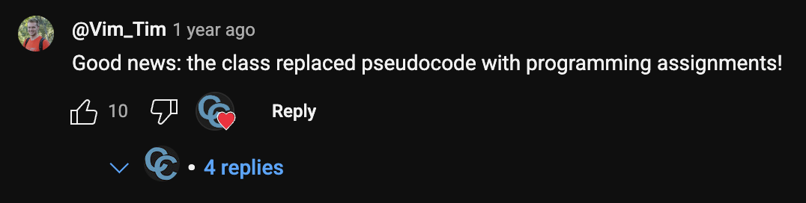
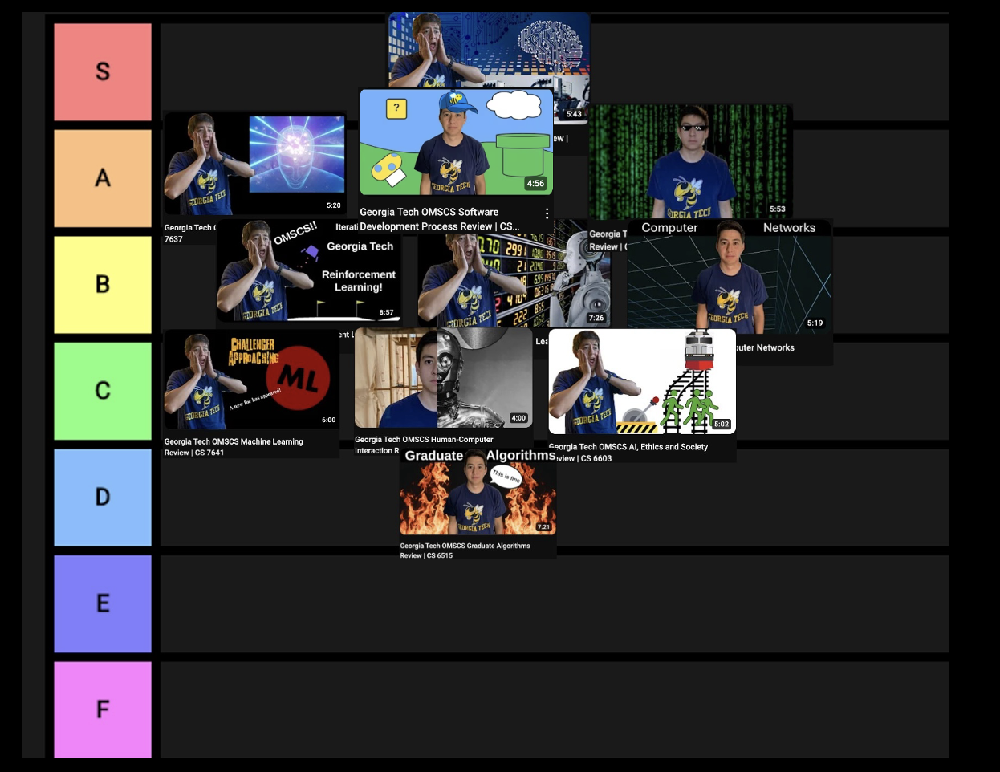

+++
title = "Georgia Tech OMSCS Tier List Class Review"
hook = "Ranking my OMSCS classes in tier-list fashion 😎"
image = "./tier-thumbnail5.jpg"
published_at = 2024-04-21T23:53:30-06:00
tags = ["OMSCS"]
youtube = "https://youtu.be/MUfhatwWttc"
+++

## Criteria
  
The critera are:

1. How well-presented is the class?
2. How hands-on is the class?
3. What are the class mechanics like?

## The classes I took

1. [Knowledge-based AI](#knowledge-based-ai)
2. [Reinforcement Learning](#reinforcement-learning)
3. [Robotics](#robotics)
4. [Machine Learning for Trading](#machine-learning-for-trading)
5. [Machine Learning](#machine-learning)
6. [AI](#ai)
7. [Computer Networks](#computer-networks)
8. [Human-Computer Interaction](#human-computer-interaction)
9. [AI, Ethics and Society](#ai-ethics-and-society)
10. [Grad Algos](#graduate-algorithms)
11. [Software Development Process](#software-development-process)

## Knowledge-based AI

- Well-presented?
    - Yes, of course, it's a Joyner class!
- Hands-on?
    - Yes, it's actually quite a lot coding, and has some really cool projects
- Class mechanics
    - Yes, very well organized
- Tier? **A**

## Reinforcement Learning

- Well-presented?
    - Yes, it is well presented (although very tough stuff!)
- Hands-on?
    - Sort-of hands on. Alot more reading than coding/building in this class
- Class mechanics
    - Yes, great interaction with the TAs on EdStem, however, grading was very subjective and slow to get back to the students
- Tier? **B**

## Robotics

- Well-presented?
    - Yes!! This class rocks!!
    - It was very cool videos and stuff, really neat stuff.
- Hands-on?
    - Yes, you do a bunch of cool projects in this class
- Class mechanics
    - Nothing to write home about, but still pretty good
- Tier? **S**

## Machine learning for trading

- Well-presented?
    - Yes, it is a bit slow in the content (it's tough but also, I think simplified for our beginning status as students in stock trading haha)
- Hands-on?
    - Yes, you actually do a lot of coding and building in this class
- Class mechanics
    - Good
- Tier? **B**

## Machine learning

- Well-presented?
    - Very well presented content
- Hands-on?
    - Tedium honestly, not super hands-on it felt.
    - Felt like a lot of busy work
- Class mechanics
    - Pretty ambiguous and mysterious grading! Good luck!
- Tier? **C**

## AI

- Well-presented?
    - Yes! It was super cool
- Hands-on?
    - Yes!! Super intense programming here! Seriously, tough programming.
- Class mechanics
    - Yes there was actually the most feedback and participation from any of the other clases. (Maybe beacause it's so hard, students just had to come together to get through it 😭😂)
- Tier? **A**

## Computer networks

- Well-presented?
    - Yes, it was a bit dry sometimes (I mean the topic itself can be dry haha)
- Hands-on?
    - Yes, there was actually 1 really good lab (the first), that was relevant to networking (I use it in my job as a networking engineer)
- Class mechanics
    - Yeah
- Tier? **B**

## Human-computer interaction

- Well-presented?
    - Yeah, it's interesting, but pretty simplistic/obvious
- Hands-on?
    - You do a lot of writing in this class, but it is pretty busy work-y. Mostly writing papers.
- Class mechanics
    - Yeah there's a lot of support for students in this class (it's a Joyner class)
- Tier? **C**

## AI, Ethics and Society

- Well-presented?
    - Yeah I think so
- Hands-on?
    - A bit fluffy
- Class mechanics
    - Yeah pretty chill
- Tier? **C**

## Graduate Algorithms

- Well-presented?
    - Well I didn't finish it so 😂 but the lecture videos were actually really cool
- Hands-on?
    - It used to not be, but I have heard it is getting better.
    - 
- Class mechanics
    - Not great at all 😂 (well sort of, like a "C" level)
- Tier? **D**

## Software Development Process

- Well-presented?
    - Yeah, it actually was
- Hands-on?
    - Yes, the way you do the group project is **very similar** to how you do real software-engineering
- Class mechanics
    - Yeah it did feel like TAs/professors did get back
- Tier? **A**

## The final Tier-List made by yours truly

