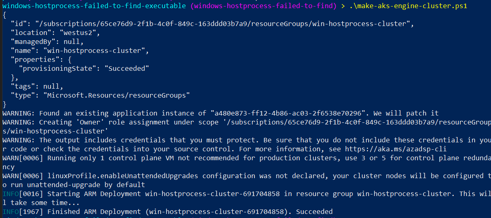
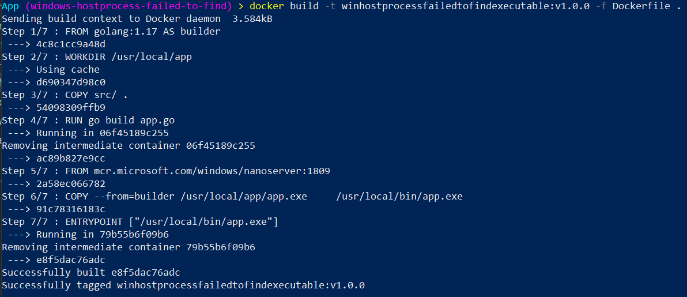
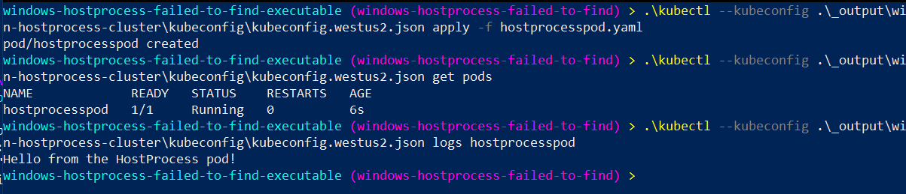

+++
title = "Windows HostProcess Pod: “failed to get application name from commandline: failed to find executable”"
hook = "The elusive `failed to get application name from commandline` error"
image = "./error.jpg"
published_at = 2022-02-19T22:03:09-06:00
tags = ["Kubernetes", "Windows"]
youtube = "https://youtu.be/x0k4M0jY6YY"
+++

`Error: failed to start containerd task "hostprocesspod": failed to get application name from commandline "/usr/local/bin/app.exe": failed to find executable "/usr/local/bin/app.exe": unknown`

Here we will find out what causes this mysterious “`Failed to find application name from commandline`” error when launching a Windows HostProcess Pod

> [Source code](https://github.com/coolstercodes/Tutorials/tree/main/tutorials/windows-hostprocess-failed-to-get-application-name)

## Create a Windows HostProcess Kubernetes cluster

To create a Windows HostProcess capable Kubernetes cluster we will use [AKS-Engine](https://github.com/Azure/aks-engine#readme)

The `make-aks-engine-cluster.ps1` script along with the `win-hostprocess-cluster.json` file does this for you, all you need to provide is a valid `subscription_id`.

The key thing to note in `win-hostprocess-cluster.json` is the `--feature-gates` flag set to `WindowsHostProcessContainers=true` which allows this cluster to host HostProcess pods.

```ps1
$SUBSCRIPTION_ID=''
$CLUSTER_NAME='win-hostprocess-cluster'
$LOCATION='westus2'
$API_MODEL='win-hostprocess-cluster.json'

# Creates the resource group which will house your cluster
az group create --subscription $SUBSCRIPTION_ID --location $LOCATION --name $CLUSTER_NAME

# Creates an Azure Service Principal to let AKS-Engine deploy resources (your cluster) to your resource group
$AZSP=az ad sp create-for-rbac --name win-cluster-service-principal --role="Owner" --scopes="/subscriptions/$SUBSCRIPTION_ID/resourceGroups/$CLUSTER_NAME" -o json | ConvertFrom-Json
$CLIENT_ID=$AZSP.appId
$CLIENT_SECRET=$AZSP.password

# Let azure permissions propogate before creating cluster
Start-Sleep -Seconds 180

# Create a hostprocess capable kubernetes cluster using AKS-Engine
.\aks-engine deploy `
    --subscription-id $SUBSCRIPTION_ID  `
    --client-id $CLIENT_ID `
    --client-secret $CLIENT_SECRET `
    --resource-group $CLUSTER_NAME `
    --dns-prefix $CLUSTER_NAME `
    --location $LOCATION `
    --api-model $API_MODEL `
    --force-overwrite
```

```json
{
    "apiVersion": "vlabs",
    "properties": {
        "orchestratorProfile": {
            "orchestratorType": "Kubernetes",
            "orchestratorRelease": "1.23",
            "kubernetesConfig": {
                "networkPlugin": "azure",
                "apiServerConfig": {
                    "--feature-gates": "WindowsHostProcessContainers=true"
                },
                "kubeletConfig": {
                    "--feature-gates": "WindowsHostProcessContainers=true"
                },
                "containerRuntime": "containerd",
                "windowsContainerdURL": "https://github.com/kubernetes-sigs/sig-windows-tools/releases/download/windows-containerd-nightly/windows-containerd.tar.gz",
                "loadBalancerSku": "basic"
            }
        },
        "masterProfile": {
            "count": 1,
            "vmSize": "Standard_D2_v2",
            "availabilityProfile": "AvailabilitySet",
            "platformUpdateDomainCount": 1
        },
        "agentPoolProfiles": [
            {
                "name": "windowspool",
                "count": 1,
                "vmSize": "Standard_D8s_v3",
                "availabilityProfile": "VirtualMachineScaleSets",
                "osType": "Windows",
                "enableVMSSNodePublicIP": true
            }
        ],
        "windowsProfile": {
            "adminUsername": "azureuser",
            "adminPassword": "password1234$",
            "sshEnabled": true,
            "enableAutomaticUpdates": true,
            "WindowsPublisher": "microsoft-aks",
            "WindowsOffer": "aks-windows",
            "WindowsSku": "2019-datacenter-core-ctrd-2108",
            "imageVersion": "17763.2061.210830"
        },
        "linuxProfile": {
            "adminUsername": "azureuser",
            "ssh": {
                "publicKeys": [
                    {
                        "keyData": ""
                    }
                ]
            }
        }
    }
}
```


*Creating a Windows HostProcess capable Kubernetes cluster using AKS-Engine*

## Containerize a simple go-lang application

Next we will “containerize” a simple go-lang application

Check out the source code for file placement but essentially, you just run this `docker` command with the Dockerfile one directory above `app.go`:

```sh
docker build -t winhostprocessfailedtofindexecutable:v1.0.0 -f Dockerfile .
```

```docker
# Use golang image to build binary
FROM golang:1.17 AS builder

# Make a working directory
WORKDIR /usr/local/app

# Copy the source code into the container
COPY src/ .

# Build the app
RUN go build app.go

# Copy the app binary into the final container image
FROM mcr.microsoft.com/windows/nanoserver:1809
COPY --from=builder /usr/local/app/app.exe \
    /usr/local/bin/app.exe

ENTRYPOINT ["/usr/local/bin/app.exe"]
```

```go
package main

import (
	"fmt"
	"time"
)

func main() {
	fmt.Println("Hello from the HostProcess pod!")

	// Sleep
	time.Sleep(1 * time.Hour)
}
```


*Containerize the simple go-lang app using Docker*

## Launch the HostProcess pod: “`failed to get application name from command line`” fixed

This error is so mysterious.

The fix is simple.

HostProcess pods are run as Windows host processes, so they inherit the same file structure as the Windows host.

That means, if in your `Dockerfile` you specified the entrypoint of the app as an absolute file path like I did i.e. `/usr/local/bin/app`.exe, then the HostProcess pod will try to find that executable on the Windows host but it can’t.

To get around this, you need to use the `%CONTAINER_SANDBOX_MOUNT_POINT%` environment variable in an `command` field in your deployment yaml like so:

```yaml
apiVersion: v1
kind: Pod
metadata:
  name: hostprocesspod
spec:
  nodeSelector:
    kubernetes.io/os: windows
  securityContext:
    windowsOptions:
      hostProcess: true
      runAsUserName: "NT AUTHORITY\\Local service"
  hostNetwork: true
  containers:
  - name: hostprocesspod
    image: coolstercodes.azurecr.io/winhostprocessfailedtofindexecutable:v1.0.0
    command: ["%CONTAINER_SANDBOX_MOUNT_POINT%/usr/local/bin/app.exe"]
```

Now you should be able to launch your pod seamlessly like so:

```shell
kubectl --kubeconfig .\_output\win-hostprocess-cluster\kubeconfig\kubeconfig.westus2.json apply -f hostprocesspod.yaml
```


*Successfully launching the HostProcess pod, you did it!*

