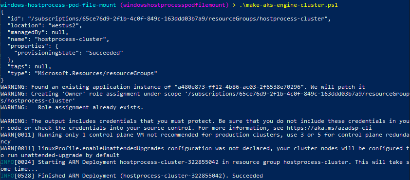
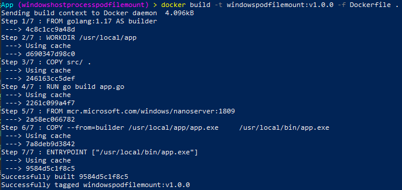
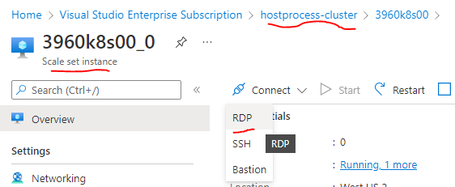
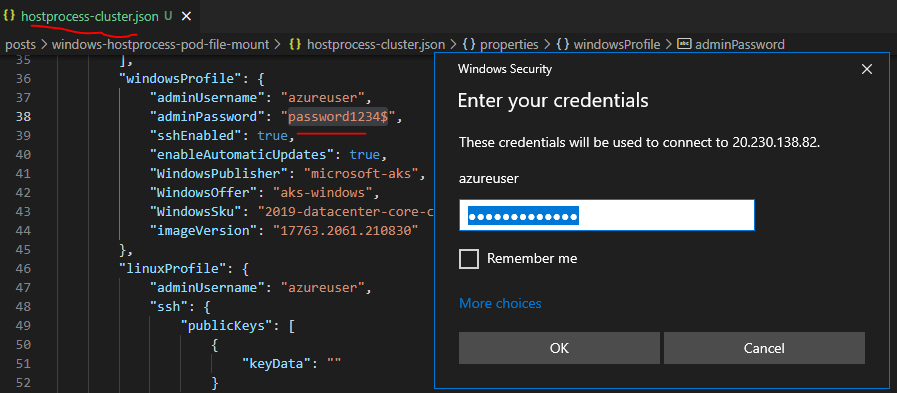
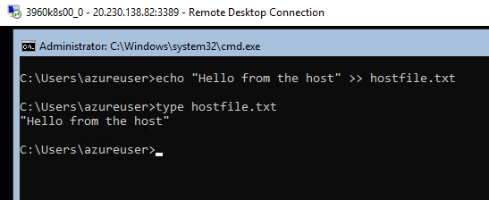
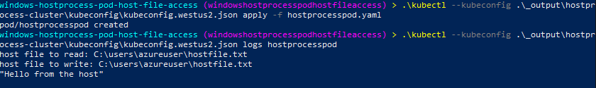
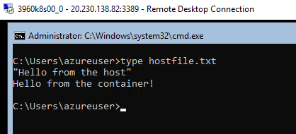

+++
title = "Windows HostProcess Pod Host File Access"
hook = "Mountins a Windows filesystem from within a pod"
image = "./folder.jpg"
published_at = 2022-04-11T20:53:30-06:00
tags = ["Windows", "Kubernetes"]
youtube = "https://youtu.be/R16AAmyuvOE"
+++

Here we will mount a file from the underlying host, into a Windows [HostProcess](https://kubernetes.io/docs/tasks/configure-pod-container/create-hostprocess-pod/#:~:text=Windows%20HostProcess%20containers%20enable%20you,given%20the%20appropriate%20user%20privileges.) pod on Kubernetes.

HostProcess pods are great for privileged access to host files [without manual permissions changes](https://coolstercodes.com/windows-pod-host-file-mount-on-kubernetes/#change-the-text-file-permissions).

> [Source code](https://github.com/coolstercodes/Tutorials/tree/main/tutorials/windows-hostprocess-pod-host-file-access)

## Create a HostProcess capable Kubernetes cluster

First we will create a HostProcess capable Kubernetes cluster in Azure using [AKS-Engine](https://github.com/Azure/aks-engine#readme)

Simply run `make-aks-engine-cluster.ps1` with `hostprocess-cluster.json` in the same directory, providing a valid `subscription_id`.

``` ps
$SUBSCRIPTION_ID='' # Provide a valid subscription id
$CLUSTER_NAME='hostprocess-cluster'
$LOCATION='westus2'
$API_MODEL='hostprocess-cluster.json'

# Creates the resource group which will house your cluster
az group create --subscription $SUBSCRIPTION_ID --location $LOCATION --name $CLUSTER_NAME

# Creates an Azure Service Principal to let AKS-Engine deploy resources (your cluster) to your resource group
$AZSP=az ad sp create-for-rbac --name win-cluster-service-principal --role="Owner" --scopes="/subscriptions/$SUBSCRIPTION_ID/resourceGroups/$CLUSTER_NAME" -o json | ConvertFrom-Json
$CLIENT_ID=$AZSP.appId
$CLIENT_SECRET=$AZSP.password

# Let azure permissions propogate before creating cluster
Start-Sleep -Seconds 180

# Create a hostprocess capable kubernetes cluster using AKS-Engine
.\aks-engine deploy `
    --subscription-id $SUBSCRIPTION_ID  `
    --client-id $CLIENT_ID `
    --client-secret $CLIENT_SECRET `
    --resource-group $CLUSTER_NAME `
    --dns-prefix $CLUSTER_NAME `
    --location $LOCATION `
    --api-model $API_MODEL `
    --force-overwrite
```

``` json
{
    "apiVersion": "vlabs",
    "properties": {
        "orchestratorProfile": {
            "orchestratorType": "Kubernetes",
            "orchestratorRelease": "1.23",
            "kubernetesConfig": {
                "networkPlugin": "azure",
                "apiServerConfig": {
                    "--feature-gates": "WindowsHostProcessContainers=true"
                },
                "kubeletConfig": {
                    "--feature-gates": "WindowsHostProcessContainers=true"
                },
                "containerRuntime": "containerd",
                "windowsContainerdURL": "https://github.com/kubernetes-sigs/sig-windows-tools/releases/download/windows-containerd-nightly/windows-containerd.tar.gz",
                "loadBalancerSku": "basic"
            }
        },
        "masterProfile": {
            "count": 1,
            "vmSize": "Standard_D2_v2",
            "availabilityProfile": "AvailabilitySet",
            "platformUpdateDomainCount": 1
        },
        "agentPoolProfiles": [
            {
                "name": "windowspool",
                "count": 1,
                "vmSize": "Standard_D8s_v3",
                "availabilityProfile": "VirtualMachineScaleSets",
                "osType": "Windows",
                "enableVMSSNodePublicIP": true
            }
        ],
        "windowsProfile": {
            "adminUsername": "azureuser",
            "adminPassword": "password1234$",
            "sshEnabled": true,
            "enableAutomaticUpdates": true,
            "WindowsPublisher": "microsoft-aks",
            "WindowsOffer": "aks-windows",
            "WindowsSku": "2019-datacenter-core-ctrd-2108",
            "imageVersion": "17763.2061.210830"
        },
        "linuxProfile": {
            "adminUsername": "azureuser",
            "ssh": {
                "publicKeys": [
                    {
                        "keyData": ""
                    }
                ]
            }
        }
    }
}
```

## Requirements

- Kubernetes version `1.23` or higher is required for HostProcess pods to work on the cluster.
- Containerd version `1.6` or higher

- `"--feature-gates": "WindowsHostProcessContainers=true"` is required in both the `apiServerConfig` as well as `kubeletConfig` of the Kubernetes cluster.

After you run `make-aks-engine-cluster.ps1` you will hopefully see successful output:


*Creating a Windows HostProcess pod capable Kubernetes cluster using AKS-Engine*

## Make a HostProcess pod

The HostProcess pod we will use is a simple go-lang application which reads and writes to a specified file.

``` go
package main

import (
	"fmt"
	"io/ioutil"
	"os"
	"time"
)

func main() {
	hostFileToReadLocation := os.Args[1]
	hostFileToWriteLocation := os.Args[2]

	fmt.Printf("host file to read: %s\n", hostFileToReadLocation)
	fmt.Printf("host file to write: %s\n", hostFileToWriteLocation)

	// Read host file from inside the container!
	content, err := ioutil.ReadFile(hostFileToReadLocation)
	if err != nil {
		fmt.Printf("Error from reading: %v\n", err)
	}
	text := string(content)
	fmt.Println(text)

	// Write to host file from inside the container!
	f, err := os.OpenFile(hostFileToWriteLocation, os.O_APPEND|os.O_WRONLY|os.O_CREATE, 0600)
	if err != nil {
		fmt.Printf("Error opening file to write: %v\n", err)
	}
	if _, err = f.WriteString("Hello from the container!\n"); err != nil {
		fmt.Printf("Error writing to file: %v\n", err)
	}

	// Sleep
	time.Sleep(1 * time.Hour)
}
```

``` docker
# Use golang image to build binary
FROM golang:1.17 AS builder

# Make a working directory
WORKDIR /usr/local/app

# Copy the source code into the container
COPY src/ .

# Build the app
RUN go build app.go

# Copy the app binary into the final container image
FROM mcr.microsoft.com/windows/nanoserver:1809
COPY --from=builder /usr/local/app/app.exe \
    /usr/local/bin/app.exe

ENTRYPOINT ["/usr/local/bin/app.exe"]
```

``` sh
docker build -t windowspodfilemount:v1.0.0 -f Dockerfile .
```

Upon execution of `docker build`, you should see output such as:


*Building docker image of an go-lang app which reads and writes to specified file*

## RDP and create a host file

We will RDP to the Windows VM and create a file called `hostfile.txt` that simply contains `Hello from the host`.

We do this simply to demonstrate how the HostProcess pod will be able to read and write to this file.


*Download RDP file to Windows VM*


*Use credentials from hostprocess-cluster.json to connect*


*Create a text file*

## Deploy the HostProcess Pod

You may notice a lack of a manual permissions step, [such as with normal Windows pods](https://coolstercodes.com/windows-pod-host-file-mount-on-kubernetes/#change-the-text-file-permissions).

This is because HostProcess pods run as, host processes, and can have elevated permissions.

The `hostprocesspod.yaml` shows this with `runAsUserName`, which lets you specify the permissions you want the pod to have.

From the [Kubernetes docs](https://kubernetes.io/docs/tasks/configure-pod-container/configure-runasusername/#windows-username-limitations):
“Examples of acceptable values for the `runAsUserName` field: `ContainerAdministrator`, `ContainerUser`, `NT AUTHORITY\\NETWORK SERVICE`, `NT AUTHORITY\\LOCAL SERVICE`.”

I [discovered though](https://kubernetes.io/docs/tasks/configure-pod-container/create-hostprocess-pod/#choosing-a-user-account) you can also specify the following for even more privileged access: `NT AUTHORITY\\SYSTEM`.

``` yaml
apiVersion: v1
kind: Pod
metadata:
  name: hostprocesspod
spec:
  nodeSelector:
    kubernetes.io/os: windows
  securityContext:
    windowsOptions:
      hostProcess: true
      runAsUserName: "NT AUTHORITY\\SYSTEM" # This lets the pod have elevated permissions
  hostNetwork: true
  containers:
  - name: winpodfilemount
    image: coolstercodes.azurecr.io/windowspodfilemount:v1.0.0
    imagePullPolicy: Always
    args: ["C:\\users\\azureuser\\hostfile.txt", "C:\\users\\azureuser\\hostfile.txt"]
    command: ["%CONTAINER_SANDBOX_MOUNT_POINT%/usr/local/bin/app.exe"]
```

``` sh
.\kubectl --kubeconfig .\_output\hostprocess-cluster\kubeconfig\kubeconfig.westus2.json apply -f hostprocesspod.yaml
```

``` sh
.\kubectl --kubeconfig .\_output\hostprocess-cluster\kubeconfig\kubeconfig.westus2.json logs hostprocesspod
```

Upon deployment using the above `kubectl` command, and inspecting the logs we’ll see:


*HostProcess pod logs*

## Verify

RDP back onto the host VM and see if the file changed:


*The hostfile.txt file changed!*

You did it! You launched a Windows HostProcess pod that lets you access host files without a manual permissions step, congratulations.
