+++
title = "Windows Pod Host File Mount on Kubernetes"
hook = "Mounting a Windows filesystem in Kubernetes"
image = "./Windows.png"
published_at = 2022-01-23T17:46:17-06:00
tags = ["Kubernetes", "Windows"]
youtube = "https://youtu.be/qMh5THrZmaA"
+++

Here we will mount the host file system into a windows pod on Kubernetes.

Alternatively, if you’re not trying to read/edit an existing host file, you can mount a brand new volume to the pod, which we will also show here.

> [Source code](https://github.com/coolstercodes/Tutorials/tree/main/tutorials/windows-pod-file-mount)

## Create Kubernetes cluster

Step one is to create or have access to a Kubernetes cluster with a Windows node.

One way to do this is to use [AKS Engine](https://github.com/Azure/aks-engine#readme), which sets up all the infrastructure for your Kubernetes cluster in Azure.

`make-aks-engine-cluster.ps1` along with `win-cluster.json` will do this for you.

All you need to provide is the subscription id you wish to deploy to:

``` bash
$SUBSCRIPTION_ID=''
$CLUSTER_NAME='win-cluster'
$LOCATION='westus2'
$API_MODEL='win-cluster.json'

# Creates the resource group which will house your cluster
az group create --subscription $SUBSCRIPTION_ID --location $LOCATION --name $CLUSTER_NAME

# Creates an Azure Service Principal to let AKS-Engine deploy resources (your cluster) to your resource group
$AZSP=az ad sp create-for-rbac --name win-cluster-service-principal --role="Owner" --scopes="/subscriptions/$SUBSCRIPTION_ID/resourceGroups/$CLUSTER_NAME" -o json | ConvertFrom-Json
$CLIENT_ID=$AZSP.appId
$CLIENT_SECRET=$AZSP.password

# Let azure permissions propogate before creating cluster
Start-Sleep -Seconds 180

# Create a hostprocess capable kubernetes cluster using AKS-Engine
.\aks-engine deploy `
    --subscription-id $SUBSCRIPTION_ID  `
    --client-id $CLIENT_ID `
    --client-secret $CLIENT_SECRET `
    --resource-group $CLUSTER_NAME `
    --dns-prefix $CLUSTER_NAME `
    --location $LOCATION `
    --api-model $API_MODEL `
    --force-overwrite

```

``` json
{
   "apiVersion": "vlabs",
   "properties": {
      "orchestratorProfile": {
         "orchestratorType": "Kubernetes",
         "orchestratorRelease": "1.23",
         "kubernetesConfig": {
            "networkPlugin": "azure",
            "containerRuntime": "containerd",
            "windowsContainerdURL": "https://github.com/kubernetes-sigs/sig-windows-tools/releases/download/windows-containerd-nightly/windows-containerd.tar.gz",
            "loadBalancerSku": "basic"
         }
      },
      "masterProfile": {
         "count": 1,
         "vmSize": "Standard_D2_v2",
         "availabilityProfile": "AvailabilitySet",
         "platformUpdateDomainCount": 1
      },
      "agentPoolProfiles": [
         {
            "name": "windowspool",
            "count": 1,
            "vmSize": "Standard_D8s_v3",
            "availabilityProfile": "VirtualMachineScaleSets",
            "osType": "Windows",
            "enableVMSSNodePublicIP": true
         }
      ],
      "windowsProfile": {
         "adminUsername": "azureuser",
         "adminPassword": "password1234$",
         "sshEnabled": true,
         "enableAutomaticUpdates": true,
         "WindowsPublisher": "microsoft-aks",
         "WindowsOffer": "aks-windows",
         "WindowsSku": "2019-datacenter-core-ctrd-2108",
         "imageVersion": "17763.2061.210830"
      },
      "linuxProfile": {
         "adminUsername": "azureuser",
         "ssh": {
            "publicKeys": [
               {
                  "keyData": ""
               }
            ]
         }
      }
   }
}
```

After execution you will hopefully see:

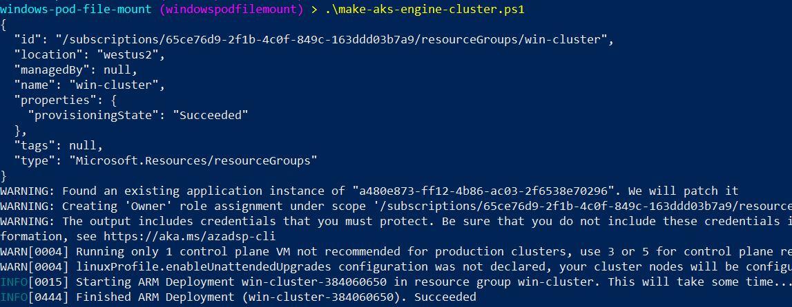
*Deploying a windows Kubernetes cluster using AKS Engine*

## RDP and create host text file

Next we’ll RDP to the Windows agent node and create a text file.

This is just to demonstrate how the pod will be able to read and write files from/to the host.

To do this navigate to your Kubernetes agent node in Azure Portal:

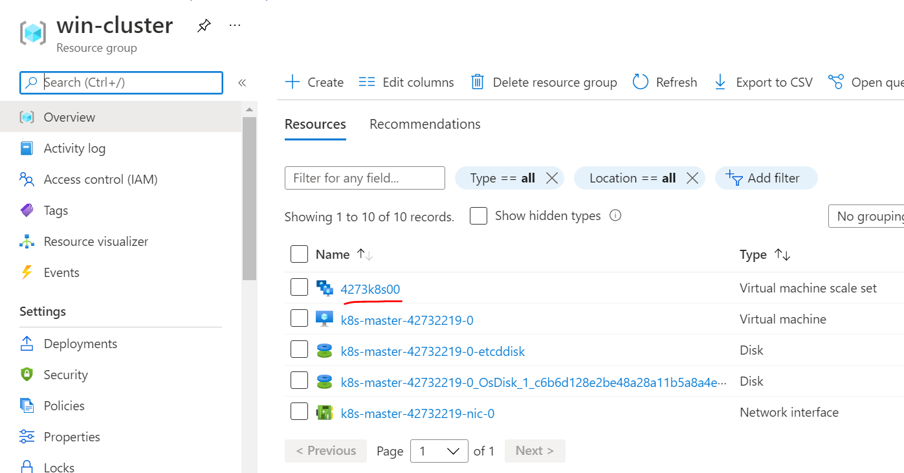

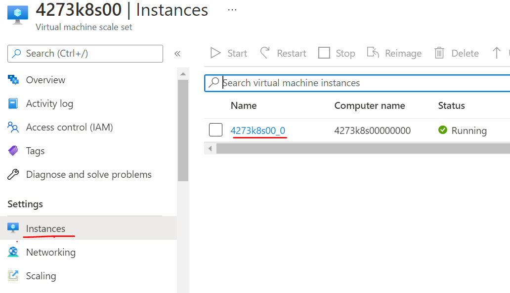

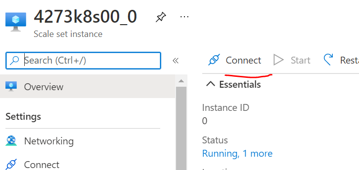

And RDP using the credentials found in `win-cluster.json`

Finally, execute notepad `hostfile.txt` and type a funny message:

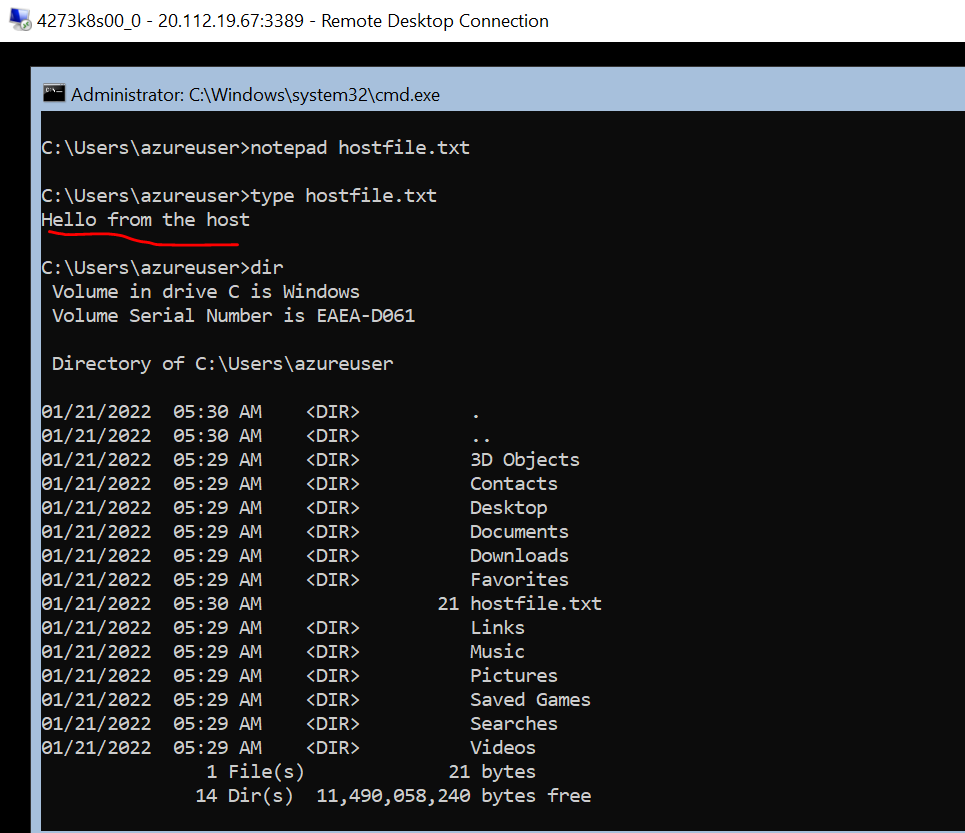
*Writing a host file which we will read and write to from inside the pod*

## Change the text file permissions

> Update 04/10/2022: Check out our post on [HostProcess pods](/windows-hostprocess-pod-host-file-access) where this step is no longer needed

Normal Windows pods can’t run as “privileged” pods, so we have to do this manual permissions step. There is a new type of Windows pod called “HostProcess” pods, which can do this by default without the permissions step, a post soon to follow about it.

For the time being, we have to give the right permissions:

``` cmd
icacls C:\users\azureuser /grant BUILTIN\Users:(OI)(CI)(F) /t
```

This command will give the directory `C:\users\azureuser` and all files/directories in it the permissions necessary for the pod to be able to read and write files.

`(OI)` and `(CI)` means that all future files in this directory will have these permissions, and `(F)` means full access. `/t` means recursively. The `BUILTIN\Users` is the group the pod will be a part of. Read more [here](https://docs.microsoft.com/en-us/windows-server/administration/windows-commands/icacls) if you’re interested.

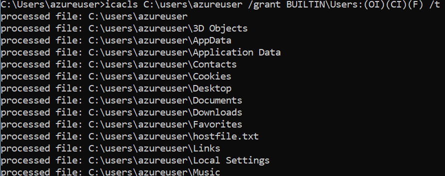
*Applying proper permissions to directory, so pod can read/write to it*

## Containerize an app which reads and writes to a file

Next we use Docker to containerize `app.go`, which simply reads and writes to a given file:

``` sh
docker build -t windowspodfilemount:v1.0.0 -f Dockerfile .
```

``` docker
# Use golang image to build binary
FROM golang:1.17 AS builder

# Make a working directory
WORKDIR /usr/local/app

# Copy the source code into the container
COPY src/ .

# Build the app
RUN go build app.go

# Copy the app binary into the final container image
FROM mcr.microsoft.com/windows/nanoserver:1809
COPY --from=builder /usr/local/app/app.exe \
    /usr/local/bin/app.exe

ENTRYPOINT ["/usr/local/bin/app.exe"]
```

``` go
package main

import (
	"fmt"
	"io/ioutil"
	"os"
	"time"
)

func main() {
	hostFileToReadLocation := os.Args[1]
	hostFileToWriteLocation := os.Args[2]

	fmt.Printf("host file to read: %s\n", hostFileToReadLocation)
	fmt.Printf("host file to write: %s\n", hostFileToWriteLocation)

	// Read host file from inside the container!
	content, err := ioutil.ReadFile(hostFileToReadLocation)
	if err != nil {
		fmt.Printf("Error from reading: %v\n", err)
	}
	text := string(content)
	fmt.Println(text)

	// Write to host file from inside the container!
	f, err := os.OpenFile(hostFileToWriteLocation, os.O_APPEND|os.O_WRONLY|os.O_CREATE, 0600)
	if err != nil {
		fmt.Printf("Error opening file to write: %v\n", err)
	}
	if _, err = f.WriteString("Hello from the container!\n"); err != nil {
		fmt.Printf("Error writing to file: %v\n", err)
	}

	// Sleep
	time.Sleep(1 * time.Hour)
}
```

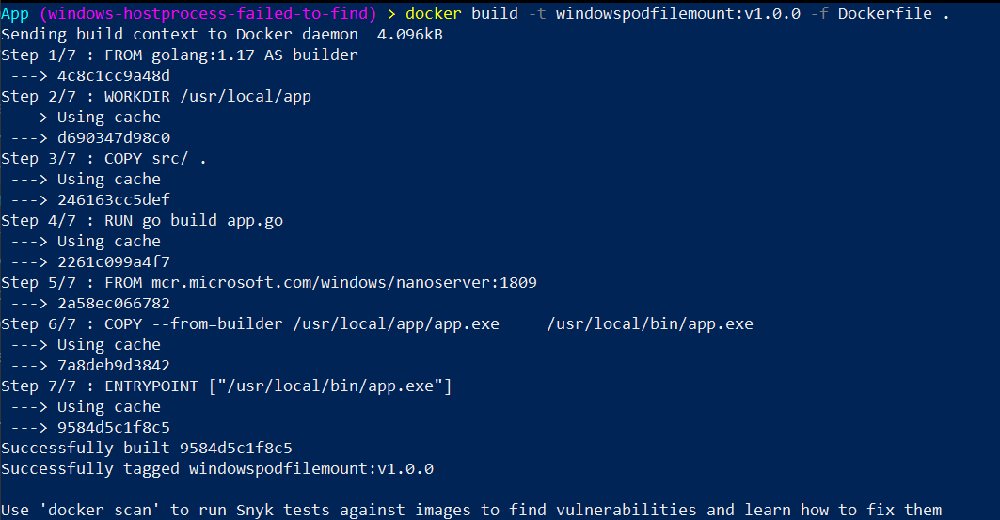
*Containerizing a simple app which reads and writes to a specified file*

## Deploy the pod with host file mount

Next we deploy the app in a Windows pod with the host file system mounted as a volume.

``` shell
.\kubectl --kubeconfig .\_output\win-cluster\kubeconfig\kubeconfig.westus2.json apply -f windowspodfilemount.yaml
```

``` yaml
apiVersion: v1
kind: Pod
metadata:
  name: winpodfilemount
spec:
  nodeSelector:
    kubernetes.io/os: windows
  containers:
  - name: winpodfilemount
    image: coolstercodes.azurecr.io/windowspodfilemount:v1.0.0
    imagePullPolicy: Always
    args: ["C:\\hostfilemount\\hostfile.txt", "C:\\hostfilemount\\hostfile.txt"]
    volumeMounts:
      - name: hostfilemount
        mountPath: /hostfilemount
  volumes:
    - name: hostfilemount
      hostPath:
        path: /users/azureuser
        type: Directory
```

After deployment you should see something like:

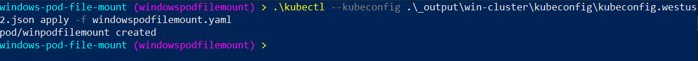
*Deploying the windows pod with file mount*

And finally view the logs with:

``` shell
.\kubectl --kubeconfig .\_output\win-cluster\kubeconfig\kubeconfig.westus2.json logs winpodfilemount
```

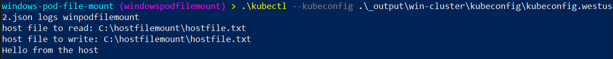
*View pod logs, you see “Hello from the host” because the pod was able to read the hostfile.txt contents*

## Verify

Now you can RDP back onto the Windows agent node and see the updated `hostfile.txt`:

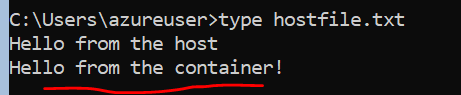
*You wrote to a host file from within the pod! Great job*

## Alternative

If you’re just trying to write to the host and it doesn’t need to be an existing directory, you could alternatively use `windowspodfilemount_alternative.yaml`, which creates a new directory on the host which the pod has full access to.

``` shell
.\kubectl --kubeconfig .\_output\win-cluster\kubeconfig\kubeconfig.westus2.json apply -f windowspodfilemount_alternative.yaml
```

``` yaml
apiVersion: v1
kind: Pod
metadata:
  name: winpodfilemount
spec:
  nodeSelector:
    kubernetes.io/os: windows
  containers:
  - name: winpodfilemount
    image: coolstercodes.azurecr.io/windowspodfilemount:v1.0.0
    imagePullPolicy: Always
    args: ["C:\\hostfilemount\\hostfile.txt", "C:\\hostfilemount\\hostfile.txt"]
    volumeMounts:
      - name: hostfilemount
        mountPath: /hostfilemount
  volumes:
    - name: hostfilemount
      hostPath:
        path: /new/host/directory
        type: DirectoryOrCreate
```

The “read” portion of the code will error out (because there’s nothing in this new directory), but the write will succeed:

``` shell
.\kubectl --kubeconfig .\_output\win-cluster\kubeconfig\kubeconfig.westus2.json logs winpodfilemount
```

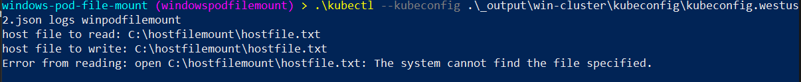
*Alternative approach where you just need to write to the host, and it doesn’t need to be an existing directory/file*

And finally you can verify by RDP’ing to the Windows agent node, that there is a new directory created by the pod:

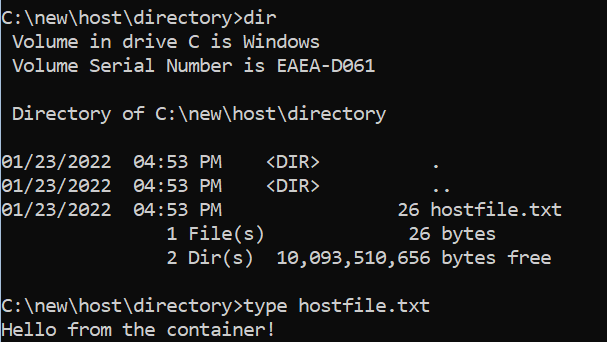
*Writing a new file to the host, in a new directory*
